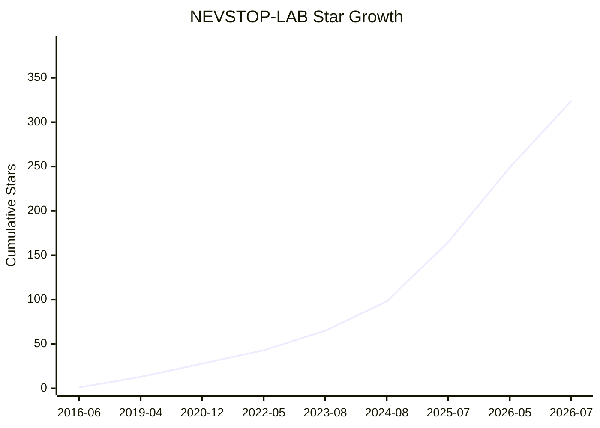

# Star History

_Last updated: 2026-07-22 17:42:01 UTC+8_  
_Total stars: 364_

## Star Growth Chart

## Top 10 Most Starred Repositories

| Rank | Repository | Stars |
|:----:|:-----------|------:|
| 1 | [`Communicable-State-Machine`](https://github.com/NEVSTOP-LAB/Communicable-State-Machine) | 65 |
| 2 | [`LabVIEW-UI-XCtl`](https://github.com/NEVSTOP-LAB/LabVIEW-UI-XCtl) | 40 |
| 3 | [`CSMScript-Lite`](https://github.com/NEVSTOP-LAB/CSMScript-Lite) | 27 |
| 4 | [`CSM-MassData-Parameter-Support`](https://github.com/NEVSTOP-LAB/CSM-MassData-Parameter-Support) | 17 |
| 5 | [`LabVIEW-GlobalStop-Library`](https://github.com/NEVSTOP-LAB/LabVIEW-GlobalStop-Library) | 15 |
| 6 | [`CSM-INI-Static-Variable-Support`](https://github.com/NEVSTOP-LAB/CSM-INI-Static-Variable-Support) | 15 |
| 7 | [`CSM-API-String-Arguments-Support`](https://github.com/NEVSTOP-LAB/CSM-API-String-Arguments-Support) | 14 |
| 8 | [`LabVIEW-QuickDrops-Manager`](https://github.com/NEVSTOP-LAB/LabVIEW-QuickDrops-Manager) | 12 |
| 9 | [`CSM-Continuous-Meausrement-and-Logging`](https://github.com/NEVSTOP-LAB/CSM-Continuous-Meausrement-and-Logging) | 11 |
| 10 | [`LabVIEW-OPCUA-XML-Library`](https://github.com/NEVSTOP-LAB/LabVIEW-OPCUA-XML-Library) | 10 |

## Top 10 Users by Stars Given

| Rank | User | Stars Given |
|:----:|:-----|------------:|
| 1 | [datadataup](https://github.com/datadataup) | 19 |
| 2 | [ghwang-Harries](https://github.com/ghwang-Harries) | 17 |
| 3 | [DK-666-6](https://github.com/DK-666-6) | 14 |
| 4 | [hanzihua123](https://github.com/hanzihua123) | 13 |
| 5 | [chenjingfang123](https://github.com/chenjingfang123) | 12 |
| 6 | [wyxfhb](https://github.com/wyxfhb) | 9 |
| 7 | [shennnw](https://github.com/shennnw) | 9 |
| 8 | [chenwm](https://github.com/chenwm) | 8 |
| 9 | [junyang0412](https://github.com/junyang0412) | 8 |
| 10 | [MySU1](https://github.com/MySU1) | 5 |

## Star Log

| Time (UTC+8) | Repository | User | Action |
|:-----------|:-----------|:-----|:------:|
| 2026-07-22 15:11:45+08:00 | [`CSM-ModSets-FileSync`](https://github.com/NEVSTOP-LAB/CSM-ModSets-FileSync) | [highland-gy](https://github.com/highland-gy) | ⭐ add |
| 2026-07-22 15:11:45+08:00 | [`CSM-Module-Repo-Template`](https://github.com/NEVSTOP-LAB/CSM-Module-Repo-Template) | [highland-gy](https://github.com/highland-gy) | ⭐ add |
| 2026-07-22 10:49:54+08:00 | [`Communicable-State-Machine`](https://github.com/NEVSTOP-LAB/Communicable-State-Machine) | [highland-gy](https://github.com/highland-gy) | ⭐ add |
| 2026-07-21 11:01:35+08:00 | [`LabVIEW-GlobalStop-Library`](https://github.com/NEVSTOP-LAB/LabVIEW-GlobalStop-Library) | [datadataup](https://github.com/datadataup) | ⭐ add |
| 2026-07-17 10:38:04+08:00 | [`Communicable-State-Machine`](https://github.com/NEVSTOP-LAB/Communicable-State-Machine) | [MavisTok](https://github.com/MavisTok) | ⭐ add |
| 2026-07-17 09:24:01+08:00 | [`LabVIEW-QuickDrops-Manager`](https://github.com/NEVSTOP-LAB/LabVIEW-QuickDrops-Manager) | [datadataup](https://github.com/datadataup) | ⭐ add |
| 2026-07-16 10:37:19+08:00 | [`CSM-INI-Static-Variable-Support`](https://github.com/NEVSTOP-LAB/CSM-INI-Static-Variable-Support) | [datadataup](https://github.com/datadataup) | ⭐ add |
| 2026-07-16 10:37:14+08:00 | [`CSM-MassData-Parameter-Support`](https://github.com/NEVSTOP-LAB/CSM-MassData-Parameter-Support) | [datadataup](https://github.com/datadataup) | ⭐ add |
| 2026-07-16 10:37:10+08:00 | [`CSM-API-String-Arguments-Support`](https://github.com/NEVSTOP-LAB/CSM-API-String-Arguments-Support) | [datadataup](https://github.com/datadataup) | ⭐ add |
| 2026-07-15 20:25:56+08:00 | [`CSM-ModSets-DAQmx`](https://github.com/NEVSTOP-LAB/CSM-ModSets-DAQmx) | [MySU1](https://github.com/MySU1) | ⭐ add |
| 2026-07-12 15:56:32+08:00 | [`Communicable-State-Machine`](https://github.com/NEVSTOP-LAB/Communicable-State-Machine) | [datadataup](https://github.com/datadataup) | ⭐ add |
| 2026-07-11 16:41:55+08:00 | [`CSM-ModSets-csmStand-OI`](https://github.com/NEVSTOP-LAB/CSM-ModSets-csmStand-OI) | [chenjingfang123](https://github.com/chenjingfang123) | ⭐ add |
| 2026-07-10 22:44:53+08:00 | [`CSM-INI-Static-Variable-Support`](https://github.com/NEVSTOP-LAB/CSM-INI-Static-Variable-Support) | [MySU1](https://github.com/MySU1) | ⭐ add |
| 2026-07-10 22:44:48+08:00 | [`CSM-MassData-Parameter-Support`](https://github.com/NEVSTOP-LAB/CSM-MassData-Parameter-Support) | [MySU1](https://github.com/MySU1) | ⭐ add |
| 2026-07-10 22:44:35+08:00 | [`CSM-API-String-Arguments-Support`](https://github.com/NEVSTOP-LAB/CSM-API-String-Arguments-Support) | [MySU1](https://github.com/MySU1) | ⭐ add |
| 2026-07-10 22:44:26+08:00 | [`Communicable-State-Machine`](https://github.com/NEVSTOP-LAB/Communicable-State-Machine) | [MySU1](https://github.com/MySU1) | ⭐ add |
| 2026-07-07 16:52:03+08:00 | [`CSMScript-Lite`](https://github.com/NEVSTOP-LAB/CSMScript-Lite) | [huipeng8](https://github.com/huipeng8) | ⭐ add |
| 2026-07-07 16:14:40+08:00 | [`LabVIEW-Hashlib`](https://github.com/NEVSTOP-LAB/LabVIEW-Hashlib) | [datadataup](https://github.com/datadataup) | ⭐ add |
| 2026-07-06 11:25:08+08:00 | [`LabVIEW-TagDB`](https://github.com/NEVSTOP-LAB/LabVIEW-TagDB) | [datadataup](https://github.com/datadataup) | ⭐ add |
| 2026-07-04 17:22:41+08:00 | [`LabVIEW-UI-XCtl`](https://github.com/NEVSTOP-LAB/LabVIEW-UI-XCtl) | [FatUltraman](https://github.com/FatUltraman) | ⭐ add |
| 2026-07-04 15:20:43+08:00 | [`CSM-TCP-Router-App`](https://github.com/NEVSTOP-LAB/CSM-TCP-Router-App) | [datadataup](https://github.com/datadataup) | ⭐ add |
| 2026-07-04 15:20:42+08:00 | [`CSM-Module-Repo-Template`](https://github.com/NEVSTOP-LAB/CSM-Module-Repo-Template) | [datadataup](https://github.com/datadataup) | ⭐ add |
| 2026-07-04 15:20:41+08:00 | [`CSM-Modsets-ScheduledCmdWindow`](https://github.com/NEVSTOP-LAB/CSM-Modsets-ScheduledCmdWindow) | [datadataup](https://github.com/datadataup) | ⭐ add |
| 2026-07-04 13:51:41+08:00 | [`mqtt-LabVIEW`](https://github.com/NEVSTOP-LAB/mqtt-LabVIEW) | [datadataup](https://github.com/datadataup) | ⭐ add |
| 2026-07-04 10:44:01+08:00 | [`CSM-ModSets-FileSync`](https://github.com/NEVSTOP-LAB/CSM-ModSets-FileSync) | [datadataup](https://github.com/datadataup) | ⭐ add |
| 2026-07-02 16:21:03+08:00 | [`G-Web-Development-with-CSM`](https://github.com/NEVSTOP-LAB/G-Web-Development-with-CSM) | [datadataup](https://github.com/datadataup) | ⭐ add |
| 2026-07-02 16:21:00+08:00 | [`csm-vsc-extension`](https://github.com/NEVSTOP-LAB/csm-vsc-extension) | [datadataup](https://github.com/datadataup) | ⭐ add |
| 2026-07-01 16:49:38+08:00 | [`CSM-INI-Static-Variable-Support`](https://github.com/NEVSTOP-LAB/CSM-INI-Static-Variable-Support) | [chenjingfang123](https://github.com/chenjingfang123) | ⭐ add |
| 2026-07-01 16:49:36+08:00 | [`CSM-MassData-Parameter-Support`](https://github.com/NEVSTOP-LAB/CSM-MassData-Parameter-Support) | [chenjingfang123](https://github.com/chenjingfang123) | ⭐ add |
| 2026-07-01 16:49:34+08:00 | [`CSM-API-String-Arguments-Support`](https://github.com/NEVSTOP-LAB/CSM-API-String-Arguments-Support) | [chenjingfang123](https://github.com/chenjingfang123) | ⭐ add |
| 2026-07-01 16:49:29+08:00 | [`Communicable-State-Machine`](https://github.com/NEVSTOP-LAB/Communicable-State-Machine) | [chenjingfang123](https://github.com/chenjingfang123) | ⭐ add |
| 2026-06-30 16:04:44+08:00 | [`CSMScript-Lite`](https://github.com/NEVSTOP-LAB/CSMScript-Lite) | [datadataup](https://github.com/datadataup) | ⭐ add |
| 2026-06-30 00:57:37+08:00 | [`CSMScript-Lite`](https://github.com/NEVSTOP-LAB/CSMScript-Lite) | [Wuliuqi0529](https://github.com/Wuliuqi0529) | ❌ delete |
| 2026-06-29 15:34:52+08:00 | [`Communicable-State-Machine`](https://github.com/NEVSTOP-LAB/Communicable-State-Machine) | [weirdweiwei](https://github.com/weirdweiwei) | ⭐ add |
| 2026-06-29 14:16:48+08:00 | [`CSMScript-Lite`](https://github.com/NEVSTOP-LAB/CSMScript-Lite) | [chenjingfang123](https://github.com/chenjingfang123) | ⭐ add |
| 2026-06-29 14:16:46+08:00 | [`CSM-TCP-Router-App`](https://github.com/NEVSTOP-LAB/CSM-TCP-Router-App) | [chenjingfang123](https://github.com/chenjingfang123) | ⭐ add |
| 2026-06-29 14:16:46+08:00 | [`CSM-Module-Repo-Template`](https://github.com/NEVSTOP-LAB/CSM-Module-Repo-Template) | [chenjingfang123](https://github.com/chenjingfang123) | ⭐ add |
| 2026-06-29 14:16:45+08:00 | [`CSM-ModSets-TagRouter`](https://github.com/NEVSTOP-LAB/CSM-ModSets-TagRouter) | [chenjingfang123](https://github.com/chenjingfang123) | ⭐ add |
| 2026-06-29 14:16:45+08:00 | [`CSM-Modsets-WaveformDisplay`](https://github.com/NEVSTOP-LAB/CSM-Modsets-WaveformDisplay) | [chenjingfang123](https://github.com/chenjingfang123) | ⭐ add |
| 2026-06-29 13:52:45+08:00 | [`CSM-ModSets-FileSync`](https://github.com/NEVSTOP-LAB/CSM-ModSets-FileSync) | [chenjingfang123](https://github.com/chenjingfang123) | ⭐ add |
| 2026-06-29 13:52:45+08:00 | [`CSM-ModSets-SplashWindow`](https://github.com/NEVSTOP-LAB/CSM-ModSets-SplashWindow) | [chenjingfang123](https://github.com/chenjingfang123) | ⭐ add |
| 2026-06-27 00:36:22+08:00 | [`CSMScript-Lite`](https://github.com/NEVSTOP-LAB/CSMScript-Lite) | [huangyao15675150529](https://github.com/huangyao15675150529) | ❌ delete |
| 2026-06-26 11:03:57+08:00 | [`CSM-Modsets-WaveformDisplay`](https://github.com/NEVSTOP-LAB/CSM-Modsets-WaveformDisplay) | [datadataup](https://github.com/datadataup) | ⭐ add |
| 2026-06-26 11:03:56+08:00 | [`CSM-ModSets-TagDB-UI`](https://github.com/NEVSTOP-LAB/CSM-ModSets-TagDB-UI) | [datadataup](https://github.com/datadataup) | ⭐ add |
| 2026-06-26 11:03:56+08:00 | [`CSM-ModSets-TagRouter`](https://github.com/NEVSTOP-LAB/CSM-ModSets-TagRouter) | [datadataup](https://github.com/datadataup) | ⭐ add |
| 2026-06-24 17:26:22+08:00 | [`CSM-INI-Static-Variable-Support`](https://github.com/NEVSTOP-LAB/CSM-INI-Static-Variable-Support) | [freddy-yu](https://github.com/freddy-yu) | ⭐ add |
| 2026-06-24 17:26:15+08:00 | [`CSM-MassData-Parameter-Support`](https://github.com/NEVSTOP-LAB/CSM-MassData-Parameter-Support) | [freddy-yu](https://github.com/freddy-yu) | ⭐ add |
| 2026-06-24 17:26:07+08:00 | [`CSM-API-String-Arguments-Support`](https://github.com/NEVSTOP-LAB/CSM-API-String-Arguments-Support) | [freddy-yu](https://github.com/freddy-yu) | ⭐ add |
| 2026-06-24 17:25:57+08:00 | [`Communicable-State-Machine`](https://github.com/NEVSTOP-LAB/Communicable-State-Machine) | [freddy-yu](https://github.com/freddy-yu) | ⭐ add |
| 2026-06-23 13:17:02+08:00 | [`CSMScript-Lite`](https://github.com/NEVSTOP-LAB/CSMScript-Lite) | [zhaochenchen4](https://github.com/zhaochenchen4) | ⭐ add |
| 2026-06-22 21:53:45+08:00 | [`NEVSTOP-LoginWindow`](https://github.com/NEVSTOP-LAB/NEVSTOP-LoginWindow) | [longhai1212](https://github.com/longhai1212) | ⭐ add |
| 2026-06-17 21:15:21+08:00 | [`CSM-INI-Static-Variable-Support`](https://github.com/NEVSTOP-LAB/CSM-INI-Static-Variable-Support) | [paynechen521](https://github.com/paynechen521) | ⭐ add |
| 2026-06-17 21:15:11+08:00 | [`CSM-MassData-Parameter-Support`](https://github.com/NEVSTOP-LAB/CSM-MassData-Parameter-Support) | [paynechen521](https://github.com/paynechen521) | ⭐ add |
| 2026-06-17 21:15:03+08:00 | [`CSM-API-String-Arguments-Support`](https://github.com/NEVSTOP-LAB/CSM-API-String-Arguments-Support) | [paynechen521](https://github.com/paynechen521) | ⭐ add |
| 2026-06-17 21:14:54+08:00 | [`Communicable-State-Machine`](https://github.com/NEVSTOP-LAB/Communicable-State-Machine) | [paynechen521](https://github.com/paynechen521) | ⭐ add |
| 2026-06-17 17:54:42+08:00 | [`CSM-INI-Static-Variable-Support`](https://github.com/NEVSTOP-LAB/CSM-INI-Static-Variable-Support) | [fergusLib](https://github.com/fergusLib) | ⭐ add |
| 2026-06-17 17:54:35+08:00 | [`CSM-MassData-Parameter-Support`](https://github.com/NEVSTOP-LAB/CSM-MassData-Parameter-Support) | [fergusLib](https://github.com/fergusLib) | ⭐ add |
| 2026-06-17 17:54:24+08:00 | [`CSM-API-String-Arguments-Support`](https://github.com/NEVSTOP-LAB/CSM-API-String-Arguments-Support) | [fergusLib](https://github.com/fergusLib) | ⭐ add |
| 2026-06-15 09:22:58+08:00 | [`CSM-INI-Static-Variable-Support`](https://github.com/NEVSTOP-LAB/CSM-INI-Static-Variable-Support) | [yangkkokk](https://github.com/yangkkokk) | ⭐ add |
| 2026-06-15 09:22:53+08:00 | [`CSM-MassData-Parameter-Support`](https://github.com/NEVSTOP-LAB/CSM-MassData-Parameter-Support) | [yangkkokk](https://github.com/yangkkokk) | ⭐ add |
| 2026-06-15 09:22:46+08:00 | [`CSM-API-String-Arguments-Support`](https://github.com/NEVSTOP-LAB/CSM-API-String-Arguments-Support) | [yangkkokk](https://github.com/yangkkokk) | ⭐ add |
| 2026-06-15 08:40:31+08:00 | [`vsc-labview-vi-support`](https://github.com/NEVSTOP-LAB/vsc-labview-vi-support) | [ghwang-Harries](https://github.com/ghwang-Harries) | ⭐ add |
| 2026-06-11 16:11:49+08:00 | [`CSM-INI-Static-Variable-Support`](https://github.com/NEVSTOP-LAB/CSM-INI-Static-Variable-Support) | [lainehan-web](https://github.com/lainehan-web) | ⭐ add |
| 2026-06-11 16:11:48+08:00 | [`CSM-MassData-Parameter-Support`](https://github.com/NEVSTOP-LAB/CSM-MassData-Parameter-Support) | [lainehan-web](https://github.com/lainehan-web) | ⭐ add |
| 2026-06-11 16:11:46+08:00 | [`CSM-API-String-Arguments-Support`](https://github.com/NEVSTOP-LAB/CSM-API-String-Arguments-Support) | [lainehan-web](https://github.com/lainehan-web) | ⭐ add |
| 2026-06-11 16:11:44+08:00 | [`Communicable-State-Machine`](https://github.com/NEVSTOP-LAB/Communicable-State-Machine) | [lainehan-web](https://github.com/lainehan-web) | ⭐ add |
| 2026-06-11 14:36:36+08:00 | [`CSMScript-Lite`](https://github.com/NEVSTOP-LAB/CSMScript-Lite) | [weirdweiwei](https://github.com/weirdweiwei) | ⭐ add |
| 2026-06-10 13:08:26+08:00 | [`CSM-Modsets-WaveformDisplay`](https://github.com/NEVSTOP-LAB/CSM-Modsets-WaveformDisplay) | [ghwang-Harries](https://github.com/ghwang-Harries) | ⭐ add |
| 2026-06-10 10:12:24+08:00 | [`CSM-ModSets-TagDB-UI`](https://github.com/NEVSTOP-LAB/CSM-ModSets-TagDB-UI) | [ghwang-Harries](https://github.com/ghwang-Harries) | ⭐ add |
| 2026-06-10 10:10:29+08:00 | [`CSM-ModSets-SplashWindow`](https://github.com/NEVSTOP-LAB/CSM-ModSets-SplashWindow) | [ghwang-Harries](https://github.com/ghwang-Harries) | ⭐ add |
| 2026-06-10 08:34:27+08:00 | [`CSM-Modsets-ScheduledCmdWindow`](https://github.com/NEVSTOP-LAB/CSM-Modsets-ScheduledCmdWindow) | [ghwang-Harries](https://github.com/ghwang-Harries) | ⭐ add |
| 2026-06-09 20:37:31+08:00 | [`CSM-ModSets-SplashWindow`](https://github.com/NEVSTOP-LAB/CSM-ModSets-SplashWindow) | [LiXinxing77](https://github.com/LiXinxing77) | ⭐ add |
| 2026-06-09 12:24:35+08:00 | [`CSM-ModSets-TagRouter`](https://github.com/NEVSTOP-LAB/CSM-ModSets-TagRouter) | [LiXinxing77](https://github.com/LiXinxing77) | ⭐ add |
| 2026-06-09 12:24:35+08:00 | [`CSM-Modsets-WaveformDisplay`](https://github.com/NEVSTOP-LAB/CSM-Modsets-WaveformDisplay) | [LiXinxing77](https://github.com/LiXinxing77) | ⭐ add |
| 2026-06-09 12:24:34+08:00 | [`CSM-ModSets-TagDB-UI`](https://github.com/NEVSTOP-LAB/CSM-ModSets-TagDB-UI) | [LiXinxing77](https://github.com/LiXinxing77) | ⭐ add |
| 2026-06-09 08:56:59+08:00 | [`CSM-Modsets-WaveformDisplay`](https://github.com/NEVSTOP-LAB/CSM-Modsets-WaveformDisplay) | [Nil-Nov](https://github.com/Nil-Nov) | ⭐ add |
| 2026-06-09 08:56:56+08:00 | [`CSM-ModSets-TagRouter`](https://github.com/NEVSTOP-LAB/CSM-ModSets-TagRouter) | [Nil-Nov](https://github.com/Nil-Nov) | ⭐ add |
| 2026-06-08 10:21:19+08:00 | [`csm-community-example`](https://github.com/NEVSTOP-LAB/csm-community-example) | [ghwang-Harries](https://github.com/ghwang-Harries) | ⭐ add |
| 2026-06-01 17:40:09+08:00 | [`CSMScript-Lite`](https://github.com/NEVSTOP-LAB/CSMScript-Lite) | [WZW-1234](https://github.com/WZW-1234) | ⭐ add |
| 2026-05-30 08:12:15+08:00 | [`CSMScript-Lite`](https://github.com/NEVSTOP-LAB/CSMScript-Lite) | [leonhu1314](https://github.com/leonhu1314) | ⭐ add |
| 2026-05-26 17:09:05+08:00 | [`Communicable-State-Machine`](https://github.com/NEVSTOP-LAB/Communicable-State-Machine) | [darren2023](https://github.com/darren2023) | ⭐ add |
| 2026-05-25 09:12:24+08:00 | [`Communicable-State-Machine`](https://github.com/NEVSTOP-LAB/Communicable-State-Machine) | [LiXinxing77](https://github.com/LiXinxing77) | ⭐ add |
| 2026-05-23 11:28:38+08:00 | [`CSMScript-Lite`](https://github.com/NEVSTOP-LAB/CSMScript-Lite) | [ZhaoLi-an](https://github.com/ZhaoLi-an) | ⭐ add |
| 2026-05-22 00:04:56+08:00 | [`CSM-ModSets-SplashWindow`](https://github.com/NEVSTOP-LAB/CSM-ModSets-SplashWindow) | [wulei2LabVIEW](https://github.com/wulei2LabVIEW) | ⭐ add |
| 2026-05-22 00:04:21+08:00 | [`LabVIEW-TagDB-RefMgr`](https://github.com/NEVSTOP-LAB/LabVIEW-TagDB-RefMgr) | [wulei2LabVIEW](https://github.com/wulei2LabVIEW) | ⭐ add |
| 2026-05-22 00:02:43+08:00 | [`CSM-Modsets-WaveformDisplay`](https://github.com/NEVSTOP-LAB/CSM-Modsets-WaveformDisplay) | [wulei2LabVIEW](https://github.com/wulei2LabVIEW) | ⭐ add |
| 2026-05-21 17:25:08+08:00 | [`CSM-ModSets-SplashWindow`](https://github.com/NEVSTOP-LAB/CSM-ModSets-SplashWindow) | [degent007](https://github.com/degent007) | ⭐ add |
| 2026-05-19 15:24:31+08:00 | [`Communicable-State-Machine`](https://github.com/NEVSTOP-LAB/Communicable-State-Machine) | [fergusLib](https://github.com/fergusLib) | ⭐ add |
| 2026-05-16 10:52:09+08:00 | [`CSMScript-Lite`](https://github.com/NEVSTOP-LAB/CSMScript-Lite) | [ZhangJingWa](https://github.com/ZhangJingWa) | ⭐ add |
| 2026-05-10 12:55:42+08:00 | [`CSM-Continuous-Meausrement-and-Logging`](https://github.com/NEVSTOP-LAB/CSM-Continuous-Meausrement-and-Logging) | [eastcheng1024](https://github.com/eastcheng1024) | ⭐ add |
| 2026-05-10 11:18:21+08:00 | [`CSM-MassData-Parameter-Support`](https://github.com/NEVSTOP-LAB/CSM-MassData-Parameter-Support) | [eastcheng1024](https://github.com/eastcheng1024) | ⭐ add |
| 2026-05-07 11:35:54+08:00 | [`CSMScript-Lite`](https://github.com/NEVSTOP-LAB/CSMScript-Lite) | [liutongxin2021](https://github.com/liutongxin2021) | ⭐ add |
| 2026-05-05 03:05:40+08:00 | [`Communicable-State-Machine`](https://github.com/NEVSTOP-LAB/Communicable-State-Machine) | [liumc](https://github.com/liumc) | ⭐ add |
| 2026-04-28 13:18:39+08:00 | [`CSMScript-Lite`](https://github.com/NEVSTOP-LAB/CSMScript-Lite) | [paynechen521](https://github.com/paynechen521) | ⭐ add |
| 2026-04-28 11:24:58+08:00 | [`CSMScript-Lite`](https://github.com/NEVSTOP-LAB/CSMScript-Lite) | [chenshuihong](https://github.com/chenshuihong) | ⭐ add |
| 2026-04-27 16:48:05+08:00 | [`Communicable-State-Machine`](https://github.com/NEVSTOP-LAB/Communicable-State-Machine) | [ahuang2023](https://github.com/ahuang2023) | ⭐ add |
| 2026-04-25 00:09:02+08:00 | [`CSMScript-Lite`](https://github.com/NEVSTOP-LAB/CSMScript-Lite) | [DK-666-6](https://github.com/DK-666-6) | ⭐ add |
| 2026-04-24 13:06:59+08:00 | [`SimpleGit-Provider`](https://github.com/NEVSTOP-LAB/SimpleGit-Provider) | [wyxfhb](https://github.com/wyxfhb) | ⭐ add |
| 2026-04-23 17:37:44+08:00 | [`Communicable-State-Machine`](https://github.com/NEVSTOP-LAB/Communicable-State-Machine) | [garyshere](https://github.com/garyshere) | ⭐ add |
| 2026-04-22 23:52:11+08:00 | [`LabVIEW-GlobalStop-Library`](https://github.com/NEVSTOP-LAB/LabVIEW-GlobalStop-Library) | [darren2023](https://github.com/darren2023) | ⭐ add |
| 2026-04-22 23:46:17+08:00 | [`CSMScript-Lite`](https://github.com/NEVSTOP-LAB/CSMScript-Lite) | [darren2023](https://github.com/darren2023) | ⭐ add |
| 2026-04-21 14:18:31+08:00 | [`CSMScript-Lite`](https://github.com/NEVSTOP-LAB/CSMScript-Lite) | [lf13051306139](https://github.com/lf13051306139) | ⭐ add |
| 2026-04-21 09:58:59+08:00 | [`CSMScript-Lite`](https://github.com/NEVSTOP-LAB/CSMScript-Lite) | [Pyrite6](https://github.com/Pyrite6) | ⭐ add |
| 2026-04-20 15:07:36+08:00 | [`CSMScript-Lite`](https://github.com/NEVSTOP-LAB/CSMScript-Lite) | [FatUltraman](https://github.com/FatUltraman) | ⭐ add |
| 2026-04-19 19:18:02+08:00 | [`CSMScript-Lite`](https://github.com/NEVSTOP-LAB/CSMScript-Lite) | [Alvin2110](https://github.com/Alvin2110) | ⭐ add |
| 2026-04-18 15:43:37+08:00 | [`CSMScript-Lite`](https://github.com/NEVSTOP-LAB/CSMScript-Lite) | [zheng-sq](https://github.com/zheng-sq) | ⭐ add |
| 2026-04-16 19:57:52+08:00 | [`CSMScript-Lite`](https://github.com/NEVSTOP-LAB/CSMScript-Lite) | [blackhawk37](https://github.com/blackhawk37) | ⭐ add |
| 2026-04-15 09:59:53+08:00 | [`CSMScript-Lite`](https://github.com/NEVSTOP-LAB/CSMScript-Lite) | [bigbirdone](https://github.com/bigbirdone) | ⭐ add |
| 2026-04-14 13:04:23+08:00 | [`CSMScript-Lite`](https://github.com/NEVSTOP-LAB/CSMScript-Lite) | [eastcheng1024](https://github.com/eastcheng1024) | ⭐ add |
| 2026-04-14 12:14:59+08:00 | [`CSMScript-Lite`](https://github.com/NEVSTOP-LAB/CSMScript-Lite) | [ghwang-Harries](https://github.com/ghwang-Harries) | ⭐ add |
| 2026-04-14 10:03:40+08:00 | [`CSMScript-Lite`](https://github.com/NEVSTOP-LAB/CSMScript-Lite) | [vanperxx](https://github.com/vanperxx) | ⭐ add |
| 2026-04-14 09:44:38+08:00 | [`CSMScript-Lite`](https://github.com/NEVSTOP-LAB/CSMScript-Lite) | [1992yangkun](https://github.com/1992yangkun) | ⭐ add |
| 2026-04-14 09:22:10+08:00 | [`CSMScript-Lite`](https://github.com/NEVSTOP-LAB/CSMScript-Lite) | [langrenchangling](https://github.com/langrenchangling) | ⭐ add |
| 2026-04-11 01:26:47+08:00 | [`LabVIEW-Version-Selector`](https://github.com/NEVSTOP-LAB/LabVIEW-Version-Selector) | [matrixx567](https://github.com/matrixx567) | ⭐ add |
| 2026-03-21 02:01:42+08:00 | [`LabVIEW-UI-XCtl`](https://github.com/NEVSTOP-LAB/LabVIEW-UI-XCtl) | [Tang-WeiFeng](https://github.com/Tang-WeiFeng) | ⭐ add |
| 2026-03-21 00:50:27+08:00 | [`LabVIEW-GlobalStop-Library`](https://github.com/NEVSTOP-LAB/LabVIEW-GlobalStop-Library) | [FatUltraman](https://github.com/FatUltraman) | ⭐ add |
| 2026-03-02 10:21:36+08:00 | [`LabVIEW-UI-XCtl`](https://github.com/NEVSTOP-LAB/LabVIEW-UI-XCtl) | [Foam123](https://github.com/Foam123) | ⭐ add |
| 2026-02-19 10:02:43+08:00 | [`LabVIEW-UI-XCtl`](https://github.com/NEVSTOP-LAB/LabVIEW-UI-XCtl) | [PoliceZ](https://github.com/PoliceZ) | ⭐ add |
| 2026-02-02 11:35:46+08:00 | [`csm-keynotes-collection`](https://github.com/NEVSTOP-LAB/csm-keynotes-collection) | [wwwymq](https://github.com/wwwymq) | ⭐ add |
| 2026-01-13 15:47:34+08:00 | [`Communicable-State-Machine`](https://github.com/NEVSTOP-LAB/Communicable-State-Machine) | [kunixYao](https://github.com/kunixYao) | ⭐ add |
| 2026-01-09 21:05:06+08:00 | [`Communicable-State-Machine`](https://github.com/NEVSTOP-LAB/Communicable-State-Machine) | [SiebenerRepublikII](https://github.com/SiebenerRepublikII) | ⭐ add |
| 2025-12-18 22:55:36+08:00 | [`Communicable-State-Machine`](https://github.com/NEVSTOP-LAB/Communicable-State-Machine) | [eastcheng1024](https://github.com/eastcheng1024) | ⭐ add |
| 2025-12-13 23:57:26+08:00 | [`CSM-MassData-Parameter-Support`](https://github.com/NEVSTOP-LAB/CSM-MassData-Parameter-Support) | [lang-hash](https://github.com/lang-hash) | ⭐ add |
| 2025-12-04 14:33:31+08:00 | [`Communicable-State-Machine`](https://github.com/NEVSTOP-LAB/Communicable-State-Machine) | [XiaoshuangZhou](https://github.com/XiaoshuangZhou) | ⭐ add |
| 2025-11-20 09:42:47+08:00 | [`LabVIEW-UI-XCtl`](https://github.com/NEVSTOP-LAB/LabVIEW-UI-XCtl) | [996996](https://github.com/996996) | ⭐ add |
| 2025-11-14 14:57:13+08:00 | [`Communicable-State-Machine`](https://github.com/NEVSTOP-LAB/Communicable-State-Machine) | [lijie19910806-del](https://github.com/lijie19910806-del) | ⭐ add |
| 2025-11-13 19:19:44+08:00 | [`Communicable-State-Machine`](https://github.com/NEVSTOP-LAB/Communicable-State-Machine) | [chencfy](https://github.com/chencfy) | ⭐ add |
| 2025-11-12 20:59:09+08:00 | [`NEVSTOP-Programming-Palette`](https://github.com/NEVSTOP-LAB/NEVSTOP-Programming-Palette) | [Renties](https://github.com/Renties) | ⭐ add |
| 2025-11-05 16:16:38+08:00 | [`Communicable-State-Machine`](https://github.com/NEVSTOP-LAB/Communicable-State-Machine) | [jlfzhz](https://github.com/jlfzhz) | ⭐ add |
| 2025-10-31 09:15:27+08:00 | [`Communicable-State-Machine`](https://github.com/NEVSTOP-LAB/Communicable-State-Machine) | [zhongweidi993](https://github.com/zhongweidi993) | ⭐ add |
| 2025-10-28 19:30:12+08:00 | [`CSM-INI-Static-Variable-Support`](https://github.com/NEVSTOP-LAB/CSM-INI-Static-Variable-Support) | [shennnw](https://github.com/shennnw) | ⭐ add |
| 2025-10-28 19:30:11+08:00 | [`CSM-Array-Parameter-Support`](https://github.com/NEVSTOP-LAB/CSM-Array-Parameter-Support) | [shennnw](https://github.com/shennnw) | ⭐ add |
| 2025-10-28 19:30:10+08:00 | [`CSM-API-String-Arguments-Support`](https://github.com/NEVSTOP-LAB/CSM-API-String-Arguments-Support) | [shennnw](https://github.com/shennnw) | ⭐ add |
| 2025-10-28 19:30:09+08:00 | [`CSM-MassData-Parameter-Support`](https://github.com/NEVSTOP-LAB/CSM-MassData-Parameter-Support) | [shennnw](https://github.com/shennnw) | ⭐ add |
| 2025-10-28 19:30:08+08:00 | [`CSM-Icon-Editor-Glyphs`](https://github.com/NEVSTOP-LAB/CSM-Icon-Editor-Glyphs) | [shennnw](https://github.com/shennnw) | ⭐ add |
| 2025-10-28 19:30:07+08:00 | [`CSM-Wiki`](https://github.com/NEVSTOP-LAB/CSM-Wiki) | [shennnw](https://github.com/shennnw) | ⭐ add |
| 2025-10-28 19:30:06+08:00 | [`Communicable-State-Machine`](https://github.com/NEVSTOP-LAB/Communicable-State-Machine) | [shennnw](https://github.com/shennnw) | ⭐ add |
| 2025-10-28 19:30:06+08:00 | [`CSM-Continuous-Meausrement-and-Logging`](https://github.com/NEVSTOP-LAB/CSM-Continuous-Meausrement-and-Logging) | [shennnw](https://github.com/shennnw) | ⭐ add |
| 2025-10-26 18:38:27+08:00 | [`CSM-TCP-Router-App`](https://github.com/NEVSTOP-LAB/CSM-TCP-Router-App) | [yangkkokk](https://github.com/yangkkokk) | ⭐ add |
| 2025-10-24 21:22:28+08:00 | [`Communicable-State-Machine`](https://github.com/NEVSTOP-LAB/Communicable-State-Machine) | [FatUltraman](https://github.com/FatUltraman) | ⭐ add |
| 2025-10-16 22:29:31+08:00 | [`Communicable-State-Machine`](https://github.com/NEVSTOP-LAB/Communicable-State-Machine) | [langrenchangling](https://github.com/langrenchangling) | ⭐ add |
| 2025-10-11 14:15:51+08:00 | [`LabVIEW-TagDB`](https://github.com/NEVSTOP-LAB/LabVIEW-TagDB) | [wyxfhb](https://github.com/wyxfhb) | ⭐ add |
| 2025-10-10 08:44:14+08:00 | [`Try-Beta-Version-of-CSMF`](https://github.com/NEVSTOP-LAB/Try-Beta-Version-of-CSMF) | [ghwang-Harries](https://github.com/ghwang-Harries) | ⭐ add |
| 2025-09-23 19:37:16+08:00 | [`Communicable-State-Machine`](https://github.com/NEVSTOP-LAB/Communicable-State-Machine) | [imthunderbird](https://github.com/imthunderbird) | ⭐ add |
| 2025-09-17 18:21:49+08:00 | [`CSM-INI-Static-Variable-Support`](https://github.com/NEVSTOP-LAB/CSM-INI-Static-Variable-Support) | [eastcheng1024](https://github.com/eastcheng1024) | ⭐ add |
| 2025-09-15 21:25:41+08:00 | [`LabVIEW-UI-XCtl`](https://github.com/NEVSTOP-LAB/LabVIEW-UI-XCtl) | [lypaser](https://github.com/lypaser) | ⭐ add |
| 2025-09-15 21:24:53+08:00 | [`NEVSTOP-Programming-Palette`](https://github.com/NEVSTOP-LAB/NEVSTOP-Programming-Palette) | [lypaser](https://github.com/lypaser) | ⭐ add |
| 2025-09-09 18:00:20+08:00 | [`Communicable-State-Machine`](https://github.com/NEVSTOP-LAB/Communicable-State-Machine) | [yangkkokk](https://github.com/yangkkokk) | ⭐ add |
| 2025-09-05 21:21:27+08:00 | [`Communicable-State-Machine`](https://github.com/NEVSTOP-LAB/Communicable-State-Machine) | [liuyang1936](https://github.com/liuyang1936) | ⭐ add |
| 2025-09-05 09:06:35+08:00 | [`LabVIEW-UI-XCtl`](https://github.com/NEVSTOP-LAB/LabVIEW-UI-XCtl) | [cht-ink](https://github.com/cht-ink) | ⭐ add |
| 2025-09-03 14:17:37+08:00 | [`Communicable-State-Machine`](https://github.com/NEVSTOP-LAB/Communicable-State-Machine) | [zhangfgwis](https://github.com/zhangfgwis) | ⭐ add |
| 2025-09-02 17:40:27+08:00 | [`Communicable-State-Machine`](https://github.com/NEVSTOP-LAB/Communicable-State-Machine) | [chenwm](https://github.com/chenwm) | ⭐ add |
| 2025-09-01 23:10:36+08:00 | [`Communicable-State-Machine`](https://github.com/NEVSTOP-LAB/Communicable-State-Machine) | [imeteorite](https://github.com/imeteorite) | ⭐ add |
| 2025-08-27 11:05:55+08:00 | [`NEVSTOP-LoginWindow`](https://github.com/NEVSTOP-LAB/NEVSTOP-LoginWindow) | [Oh-Doo-Yong](https://github.com/Oh-Doo-Yong) | ⭐ add |
| 2025-08-27 10:28:39+08:00 | [`LabVIEW-UI-XCtl`](https://github.com/NEVSTOP-LAB/LabVIEW-UI-XCtl) | [Oh-Doo-Yong](https://github.com/Oh-Doo-Yong) | ⭐ add |
| 2025-08-22 16:55:21+08:00 | [`CSM-TCP-Router-App`](https://github.com/NEVSTOP-LAB/CSM-TCP-Router-App) | [liuyang1936](https://github.com/liuyang1936) | ⭐ add |
| 2025-08-21 12:45:04+08:00 | [`NEVSTOP-LoginWindow`](https://github.com/NEVSTOP-LAB/NEVSTOP-LoginWindow) | [WillsHuang2022](https://github.com/WillsHuang2022) | ⭐ add |
| 2025-08-20 10:48:06+08:00 | [`CSM-Array-Parameter-Support`](https://github.com/NEVSTOP-LAB/CSM-Array-Parameter-Support) | [chenwm](https://github.com/chenwm) | ⭐ add |
| 2025-08-20 10:48:05+08:00 | [`CSM-API-String-Arguments-Support`](https://github.com/NEVSTOP-LAB/CSM-API-String-Arguments-Support) | [chenwm](https://github.com/chenwm) | ⭐ add |
| 2025-08-20 10:47:58+08:00 | [`CSM-MassData-Parameter-Support`](https://github.com/NEVSTOP-LAB/CSM-MassData-Parameter-Support) | [chenwm](https://github.com/chenwm) | ⭐ add |
| 2025-08-20 10:47:56+08:00 | [`CSM-Icon-Editor-Glyphs`](https://github.com/NEVSTOP-LAB/CSM-Icon-Editor-Glyphs) | [chenwm](https://github.com/chenwm) | ⭐ add |
| 2025-08-20 10:47:53+08:00 | [`CSM-Wiki`](https://github.com/NEVSTOP-LAB/CSM-Wiki) | [chenwm](https://github.com/chenwm) | ⭐ add |
| 2025-08-20 10:47:52+08:00 | [`CSM-Continuous-Meausrement-and-Logging`](https://github.com/NEVSTOP-LAB/CSM-Continuous-Meausrement-and-Logging) | [chenwm](https://github.com/chenwm) | ⭐ add |
| 2025-07-27 15:11:44+08:00 | [`CSM-Continuous-Meausrement-and-Logging`](https://github.com/NEVSTOP-LAB/CSM-Continuous-Meausrement-and-Logging) | [ghwang-Harries](https://github.com/ghwang-Harries) | ⭐ add |
| 2025-07-27 15:11:28+08:00 | [`CSM-TCP-Router-App`](https://github.com/NEVSTOP-LAB/CSM-TCP-Router-App) | [ghwang-Harries](https://github.com/ghwang-Harries) | ⭐ add |
| 2025-07-27 15:10:47+08:00 | [`CSM-INI-Static-Variable-Support`](https://github.com/NEVSTOP-LAB/CSM-INI-Static-Variable-Support) | [ghwang-Harries](https://github.com/ghwang-Harries) | ⭐ add |
| 2025-07-27 15:10:28+08:00 | [`CSM-API-String-Arguments-Support`](https://github.com/NEVSTOP-LAB/CSM-API-String-Arguments-Support) | [ghwang-Harries](https://github.com/ghwang-Harries) | ⭐ add |
| 2025-07-27 15:10:19+08:00 | [`CSM-MassData-Parameter-Support`](https://github.com/NEVSTOP-LAB/CSM-MassData-Parameter-Support) | [ghwang-Harries](https://github.com/ghwang-Harries) | ⭐ add |
| 2025-07-27 14:55:58+08:00 | [`NEVSTOP-Programming-Palette`](https://github.com/NEVSTOP-LAB/NEVSTOP-Programming-Palette) | [ghwang-Harries](https://github.com/ghwang-Harries) | ⭐ add |
| 2025-07-27 14:52:28+08:00 | [`CSM-Icon-Editor-Glyphs`](https://github.com/NEVSTOP-LAB/CSM-Icon-Editor-Glyphs) | [ghwang-Harries](https://github.com/ghwang-Harries) | ⭐ add |
| 2025-07-27 14:51:51+08:00 | [`Communicable-State-Machine`](https://github.com/NEVSTOP-LAB/Communicable-State-Machine) | [ghwang-Harries](https://github.com/ghwang-Harries) | ⭐ add |
| 2025-07-27 14:41:17+08:00 | [`CSM-ModSets-FileSync`](https://github.com/NEVSTOP-LAB/CSM-ModSets-FileSync) | [ghwang-Harries](https://github.com/ghwang-Harries) | ⭐ add |
| 2025-07-22 18:25:38+08:00 | [`NEVSTOP-Programming-Palette`](https://github.com/NEVSTOP-LAB/NEVSTOP-Programming-Palette) | [Ali6114](https://github.com/Ali6114) | ⭐ add |
| 2025-07-06 15:39:25+08:00 | [`Communicable-State-Machine`](https://github.com/NEVSTOP-LAB/Communicable-State-Machine) | [1003727982](https://github.com/1003727982) | ⭐ add |
| 2025-07-04 09:01:01+08:00 | [`LabVIEW-UI-XCtl`](https://github.com/NEVSTOP-LAB/LabVIEW-UI-XCtl) | [Automan-wfq](https://github.com/Automan-wfq) | ⭐ add |
| 2025-06-29 00:10:59+08:00 | [`NEVSTOP-LoginWindow`](https://github.com/NEVSTOP-LAB/NEVSTOP-LoginWindow) | [IkunYoung](https://github.com/IkunYoung) | ⭐ add |
| 2025-06-29 00:03:47+08:00 | [`CSM-TCP-Router-App`](https://github.com/NEVSTOP-LAB/CSM-TCP-Router-App) | [IkunYoung](https://github.com/IkunYoung) | ⭐ add |
| 2025-06-25 20:09:47+08:00 | [`Communicable-State-Machine`](https://github.com/NEVSTOP-LAB/Communicable-State-Machine) | [smileJF](https://github.com/smileJF) | ⭐ add |
| 2025-06-17 05:40:04+08:00 | [`CSM-Wiki`](https://github.com/NEVSTOP-LAB/CSM-Wiki) | [IkunYoung](https://github.com/IkunYoung) | ⭐ add |
| 2025-06-16 15:51:06+08:00 | [`Communicable-State-Machine`](https://github.com/NEVSTOP-LAB/Communicable-State-Machine) | [coyote259](https://github.com/coyote259) | ⭐ add |
| 2025-06-15 20:42:46+08:00 | [`Communicable-State-Machine`](https://github.com/NEVSTOP-LAB/Communicable-State-Machine) | [1992yangkun](https://github.com/1992yangkun) | ⭐ add |
| 2025-06-11 13:32:06+08:00 | [`CSM-ModSets-FileSync`](https://github.com/NEVSTOP-LAB/CSM-ModSets-FileSync) | [wyxfhb](https://github.com/wyxfhb) | ⭐ add |
| 2025-06-11 08:17:22+08:00 | [`CSM-ModSets-FileSync`](https://github.com/NEVSTOP-LAB/CSM-ModSets-FileSync) | [huipeng8](https://github.com/huipeng8) | ⭐ add |
| 2025-06-09 09:08:36+08:00 | [`Communicable-State-Machine`](https://github.com/NEVSTOP-LAB/Communicable-State-Machine) | [wwwymq](https://github.com/wwwymq) | ⭐ add |
| 2025-06-04 06:49:42+08:00 | [`LabVIEW-QuickDrops-Manager`](https://github.com/NEVSTOP-LAB/LabVIEW-QuickDrops-Manager) | [lypaser](https://github.com/lypaser) | ⭐ add |
| 2025-05-29 16:07:56+08:00 | [`Communicable-State-Machine`](https://github.com/NEVSTOP-LAB/Communicable-State-Machine) | [2279790684](https://github.com/2279790684) | ⭐ add |
| 2025-05-29 13:46:49+08:00 | [`NEVSTOP-LoginWindow`](https://github.com/NEVSTOP-LAB/NEVSTOP-LoginWindow) | [Router0824](https://github.com/Router0824) | ⭐ add |
| 2025-05-26 00:18:51+08:00 | [`Communicable-State-Machine`](https://github.com/NEVSTOP-LAB/Communicable-State-Machine) | [willemLam](https://github.com/willemLam) | ⭐ add |
| 2025-05-17 00:07:39+08:00 | [`CSM-TCP-Router-App`](https://github.com/NEVSTOP-LAB/CSM-TCP-Router-App) | [DK-666-6](https://github.com/DK-666-6) | ⭐ add |
| 2025-05-17 00:06:05+08:00 | [`csm-keynotes-collection`](https://github.com/NEVSTOP-LAB/csm-keynotes-collection) | [DK-666-6](https://github.com/DK-666-6) | ⭐ add |
| 2025-05-17 00:06:03+08:00 | [`CSM-Helper-Development`](https://github.com/NEVSTOP-LAB/CSM-Helper-Development) | [DK-666-6](https://github.com/DK-666-6) | ⭐ add |
| 2025-05-17 00:06:02+08:00 | [`CSM-Benchmark`](https://github.com/NEVSTOP-LAB/CSM-Benchmark) | [DK-666-6](https://github.com/DK-666-6) | ⭐ add |
| 2025-05-17 00:06:01+08:00 | [`CSM-Array-Parameter-Support`](https://github.com/NEVSTOP-LAB/CSM-Array-Parameter-Support) | [DK-666-6](https://github.com/DK-666-6) | ⭐ add |
| 2025-05-17 00:06:00+08:00 | [`CSM-API-String-Arguments-Support`](https://github.com/NEVSTOP-LAB/CSM-API-String-Arguments-Support) | [DK-666-6](https://github.com/DK-666-6) | ⭐ add |
| 2025-05-17 00:05:59+08:00 | [`CSM-INI-Static-Variable-Support`](https://github.com/NEVSTOP-LAB/CSM-INI-Static-Variable-Support) | [DK-666-6](https://github.com/DK-666-6) | ⭐ add |
| 2025-05-17 00:05:58+08:00 | [`CSM-MassData-Parameter-Support`](https://github.com/NEVSTOP-LAB/CSM-MassData-Parameter-Support) | [DK-666-6](https://github.com/DK-666-6) | ⭐ add |
| 2025-05-17 00:05:56+08:00 | [`CSM-Mermaid-Plugin`](https://github.com/NEVSTOP-LAB/CSM-Mermaid-Plugin) | [DK-666-6](https://github.com/DK-666-6) | ⭐ add |
| 2025-05-17 00:05:53+08:00 | [`CSM-Icon-Editor-Glyphs`](https://github.com/NEVSTOP-LAB/CSM-Icon-Editor-Glyphs) | [DK-666-6](https://github.com/DK-666-6) | ⭐ add |
| 2025-05-17 00:05:52+08:00 | [`CSM-Wiki`](https://github.com/NEVSTOP-LAB/CSM-Wiki) | [DK-666-6](https://github.com/DK-666-6) | ⭐ add |
| 2025-05-17 00:05:50+08:00 | [`Communicable-State-Machine`](https://github.com/NEVSTOP-LAB/Communicable-State-Machine) | [DK-666-6](https://github.com/DK-666-6) | ⭐ add |
| 2025-05-17 00:05:43+08:00 | [`CSM-Continuous-Meausrement-and-Logging`](https://github.com/NEVSTOP-LAB/CSM-Continuous-Meausrement-and-Logging) | [DK-666-6](https://github.com/DK-666-6) | ⭐ add |
| 2025-04-29 18:59:01+08:00 | [`CSM-INI-Static-Variable-Support`](https://github.com/NEVSTOP-LAB/CSM-INI-Static-Variable-Support) | [wulei2LabVIEW](https://github.com/wulei2LabVIEW) | ⭐ add |
| 2025-04-25 18:52:48+08:00 | [`LabVIEW-TDMS-Viewer`](https://github.com/NEVSTOP-LAB/LabVIEW-TDMS-Viewer) | [qwtel](https://github.com/qwtel) | ⭐ add |
| 2025-04-25 16:45:14+08:00 | [`LabVIEW-QuickDrops-Manager`](https://github.com/NEVSTOP-LAB/LabVIEW-QuickDrops-Manager) | [srilogesh](https://github.com/srilogesh) | ⭐ add |
| 2025-04-19 13:14:35+08:00 | [`LabVIEW-TagDB`](https://github.com/NEVSTOP-LAB/LabVIEW-TagDB) | [teatreeoil](https://github.com/teatreeoil) | ⭐ add |
| 2025-04-14 15:07:15+08:00 | [`Communicable-State-Machine`](https://github.com/NEVSTOP-LAB/Communicable-State-Machine) | [Freddd13](https://github.com/Freddd13) | ⭐ add |
| 2025-03-29 00:11:42+08:00 | [`Communicable-State-Machine`](https://github.com/NEVSTOP-LAB/Communicable-State-Machine) | [Mendle](https://github.com/Mendle) | ⭐ add |
| 2025-03-26 12:19:45+08:00 | [`NEVSTOP-LoginWindow`](https://github.com/NEVSTOP-LAB/NEVSTOP-LoginWindow) | [junyang0412](https://github.com/junyang0412) | ⭐ add |
| 2025-03-26 12:19:36+08:00 | [`CSM-TCP-Router-App`](https://github.com/NEVSTOP-LAB/CSM-TCP-Router-App) | [junyang0412](https://github.com/junyang0412) | ⭐ add |
| 2025-03-26 12:19:29+08:00 | [`CSM-Mermaid-Plugin`](https://github.com/NEVSTOP-LAB/CSM-Mermaid-Plugin) | [junyang0412](https://github.com/junyang0412) | ⭐ add |
| 2025-03-26 12:19:03+08:00 | [`CSM-Continuous-Meausrement-and-Logging`](https://github.com/NEVSTOP-LAB/CSM-Continuous-Meausrement-and-Logging) | [junyang0412](https://github.com/junyang0412) | ⭐ add |
| 2025-03-26 12:17:47+08:00 | [`lvCICD`](https://github.com/NEVSTOP-LAB/lvCICD) | [junyang0412](https://github.com/junyang0412) | ⭐ add |
| 2025-02-16 17:31:45+08:00 | [`LabVIEW-GlobalStop-Library`](https://github.com/NEVSTOP-LAB/LabVIEW-GlobalStop-Library) | [etfovac](https://github.com/etfovac) | ⭐ add |
| 2025-02-11 19:51:45+08:00 | [`LabVIEW-UI-XCtl`](https://github.com/NEVSTOP-LAB/LabVIEW-UI-XCtl) | [0070707](https://github.com/0070707) | ⭐ add |
| 2025-01-20 07:44:56+08:00 | [`LabVIEW-UI-XCtl`](https://github.com/NEVSTOP-LAB/LabVIEW-UI-XCtl) | [Richi-Wu](https://github.com/Richi-Wu) | ⭐ add |
| 2025-01-20 00:20:17+08:00 | [`LabVIEW-UI-XCtl`](https://github.com/NEVSTOP-LAB/LabVIEW-UI-XCtl) | [NIHAO12128](https://github.com/NIHAO12128) | ⭐ add |
| 2025-01-14 19:05:38+08:00 | [`TestStand-User-Interface-Messages-Demo`](https://github.com/NEVSTOP-LAB/TestStand-User-Interface-Messages-Demo) | [chenshuihong](https://github.com/chenshuihong) | ⭐ add |
| 2025-01-04 05:16:52+08:00 | [`Communicable-State-Machine`](https://github.com/NEVSTOP-LAB/Communicable-State-Machine) | [etfovac](https://github.com/etfovac) | ⭐ add |
| 2025-01-03 12:10:08+08:00 | [`CSM-Continuous-Meausrement-and-Logging`](https://github.com/NEVSTOP-LAB/CSM-Continuous-Meausrement-and-Logging) | [wyxfhb](https://github.com/wyxfhb) | ⭐ add |
| 2025-01-03 12:09:58+08:00 | [`Communicable-State-Machine`](https://github.com/NEVSTOP-LAB/Communicable-State-Machine) | [wyxfhb](https://github.com/wyxfhb) | ⭐ add |
| 2025-01-01 01:08:24+08:00 | [`LabVIEW-UI-XCtl`](https://github.com/NEVSTOP-LAB/LabVIEW-UI-XCtl) | [NashShen](https://github.com/NashShen) | ⭐ add |
| 2024-12-21 00:45:08+08:00 | [`NEVSTOP-3rdParty-Dependencies`](https://github.com/NEVSTOP-LAB/NEVSTOP-3rdParty-Dependencies) | [ervinjay](https://github.com/ervinjay) | ⭐ add |
| 2024-12-07 21:06:13+08:00 | [`Communicable-State-Machine`](https://github.com/NEVSTOP-LAB/Communicable-State-Machine) | [QingNing3028](https://github.com/QingNing3028) | ⭐ add |
| 2024-11-13 15:56:46+08:00 | [`Communicable-State-Machine`](https://github.com/NEVSTOP-LAB/Communicable-State-Machine) | [luferau](https://github.com/luferau) | ⭐ add |
| 2024-11-12 13:59:18+08:00 | [`Communicable-State-Machine`](https://github.com/NEVSTOP-LAB/Communicable-State-Machine) | [gaoruhao](https://github.com/gaoruhao) | ⭐ add |
| 2024-11-07 16:42:49+08:00 | [`Communicable-State-Machine`](https://github.com/NEVSTOP-LAB/Communicable-State-Machine) | [xuyuandao](https://github.com/xuyuandao) | ⭐ add |
| 2024-10-22 22:21:48+08:00 | [`labview_win_util32`](https://github.com/NEVSTOP-LAB/labview_win_util32) | [fisothemes](https://github.com/fisothemes) | ⭐ add |
| 2024-10-16 14:45:03+08:00 | [`LabVIEW-Multiwork-Thread-Example`](https://github.com/NEVSTOP-LAB/LabVIEW-Multiwork-Thread-Example) | [junyang0412](https://github.com/junyang0412) | ⭐ add |
| 2024-10-16 14:44:21+08:00 | [`LabVIEW-TimerEngine`](https://github.com/NEVSTOP-LAB/LabVIEW-TimerEngine) | [junyang0412](https://github.com/junyang0412) | ⭐ add |
| 2024-10-16 14:31:03+08:00 | [`Communicable-State-Machine`](https://github.com/NEVSTOP-LAB/Communicable-State-Machine) | [junyang0412](https://github.com/junyang0412) | ⭐ add |
| 2024-08-02 04:50:34+08:00 | [`CSM-Continuous-Meausrement-and-Logging`](https://github.com/NEVSTOP-LAB/CSM-Continuous-Meausrement-and-Logging) | [Jend4s](https://github.com/Jend4s) | ⭐ add |
| 2024-08-01 09:29:06+08:00 | [`LabVIEW-UI-XCtl`](https://github.com/NEVSTOP-LAB/LabVIEW-UI-XCtl) | [wyxfhb](https://github.com/wyxfhb) | ⭐ add |
| 2024-06-28 19:46:35+08:00 | [`CSM-Icon-Editor-Glyphs`](https://github.com/NEVSTOP-LAB/CSM-Icon-Editor-Glyphs) | [achuthaperumal](https://github.com/achuthaperumal) | ⭐ add |
| 2024-06-28 17:39:48+08:00 | [`CSM-Icon-Editor-Glyphs`](https://github.com/NEVSTOP-LAB/CSM-Icon-Editor-Glyphs) | [AntoineChalons](https://github.com/AntoineChalons) | ⭐ add |
| 2024-06-19 15:21:04+08:00 | [`LabVIEW-UI-XCtl`](https://github.com/NEVSTOP-LAB/LabVIEW-UI-XCtl) | [chenduxiu01](https://github.com/chenduxiu01) | ⭐ add |
| 2024-05-30 22:37:44+08:00 | [`CSM-Continuous-Meausrement-and-Logging`](https://github.com/NEVSTOP-LAB/CSM-Continuous-Meausrement-and-Logging) | [hanzihua123](https://github.com/hanzihua123) | ⭐ add |
| 2024-05-30 22:37:15+08:00 | [`CSM-Wiki`](https://github.com/NEVSTOP-LAB/CSM-Wiki) | [hanzihua123](https://github.com/hanzihua123) | ⭐ add |
| 2024-05-14 08:33:00+08:00 | [`CSM-Mermaid-Plugin`](https://github.com/NEVSTOP-LAB/CSM-Mermaid-Plugin) | [hanzihua123](https://github.com/hanzihua123) | ⭐ add |
| 2024-05-10 09:25:35+08:00 | [`Communicable-State-Machine`](https://github.com/NEVSTOP-LAB/Communicable-State-Machine) | [DongqingHai](https://github.com/DongqingHai) | ⭐ add |
| 2024-05-08 09:22:58+08:00 | [`Communicable-State-Machine`](https://github.com/NEVSTOP-LAB/Communicable-State-Machine) | [httpashu](https://github.com/httpashu) | ⭐ add |
| 2024-04-24 09:22:57+08:00 | [`LabVIEW-Program-run-on-startup`](https://github.com/NEVSTOP-LAB/LabVIEW-Program-run-on-startup) | [hanzihua123](https://github.com/hanzihua123) | ⭐ add |
| 2024-04-24 09:14:51+08:00 | [`Communicable-State-Machine`](https://github.com/NEVSTOP-LAB/Communicable-State-Machine) | [hanzihua123](https://github.com/hanzihua123) | ⭐ add |
| 2024-04-23 06:37:44+08:00 | [`Communicable-State-Machine`](https://github.com/NEVSTOP-LAB/Communicable-State-Machine) | [bigbirdone](https://github.com/bigbirdone) | ⭐ add |
| 2024-04-09 16:44:38+08:00 | [`LabVIEW-UI-XCtl`](https://github.com/NEVSTOP-LAB/LabVIEW-UI-XCtl) | [JohnJiangsong](https://github.com/JohnJiangsong) | ⭐ add |
| 2024-04-09 16:39:50+08:00 | [`Communicable-State-Machine`](https://github.com/NEVSTOP-LAB/Communicable-State-Machine) | [JohnJiangsong](https://github.com/JohnJiangsong) | ⭐ add |
| 2024-03-20 15:30:38+08:00 | [`LabVIEW-QuickDrops-Manager`](https://github.com/NEVSTOP-LAB/LabVIEW-QuickDrops-Manager) | [hanzihua123](https://github.com/hanzihua123) | ⭐ add |
| 2024-01-10 07:18:25+08:00 | [`NEVSTOP-LoginWindow`](https://github.com/NEVSTOP-LAB/NEVSTOP-LoginWindow) | [hanzihua123](https://github.com/hanzihua123) | ⭐ add |
| 2024-01-09 22:31:43+08:00 | [`LabVIEW-UI-XCtl`](https://github.com/NEVSTOP-LAB/LabVIEW-UI-XCtl) | [okoscielny](https://github.com/okoscielny) | ⭐ add |
| 2024-01-09 00:51:24+08:00 | [`CSM-Wiki`](https://github.com/NEVSTOP-LAB/CSM-Wiki) | [jordanmsmith](https://github.com/jordanmsmith) | ⭐ add |
| 2023-12-22 17:09:12+08:00 | [`Communicable-State-Machine`](https://github.com/NEVSTOP-LAB/Communicable-State-Machine) | [YunhuaLiu](https://github.com/YunhuaLiu) | ⭐ add |
| 2023-12-03 23:04:45+08:00 | [`NEVSTOP-Programming-Palette`](https://github.com/NEVSTOP-LAB/NEVSTOP-Programming-Palette) | [Alvin2110](https://github.com/Alvin2110) | ⭐ add |
| 2023-11-15 21:57:46+08:00 | [`Communicable-State-Machine`](https://github.com/NEVSTOP-LAB/Communicable-State-Machine) | [YangZeCN](https://github.com/YangZeCN) | ⭐ add |
| 2023-10-27 17:03:25+08:00 | [`labview_win_util32`](https://github.com/NEVSTOP-LAB/labview_win_util32) | [LJS006](https://github.com/LJS006) | ⭐ add |
| 2023-10-07 00:03:31+08:00 | [`CSM-Benchmark`](https://github.com/NEVSTOP-LAB/CSM-Benchmark) | [philippe-nuaa](https://github.com/philippe-nuaa) | ⭐ add |
| 2023-10-07 00:03:03+08:00 | [`CSM-MassData-Parameter-Support`](https://github.com/NEVSTOP-LAB/CSM-MassData-Parameter-Support) | [philippe-nuaa](https://github.com/philippe-nuaa) | ⭐ add |
| 2023-10-07 00:02:31+08:00 | [`Communicable-State-Machine`](https://github.com/NEVSTOP-LAB/Communicable-State-Machine) | [philippe-nuaa](https://github.com/philippe-nuaa) | ⭐ add |
| 2023-10-07 00:00:19+08:00 | [`LabVIEW-UI-XCtl`](https://github.com/NEVSTOP-LAB/LabVIEW-UI-XCtl) | [philippe-nuaa](https://github.com/philippe-nuaa) | ⭐ add |
| 2023-09-11 09:21:17+08:00 | [`LabVIEW-OPCUA-XML-Library`](https://github.com/NEVSTOP-LAB/LabVIEW-OPCUA-XML-Library) | [Happiness188](https://github.com/Happiness188) | ⭐ add |
| 2023-09-09 16:51:28+08:00 | [`LabVIEW-TDMS-Viewer`](https://github.com/NEVSTOP-LAB/LabVIEW-TDMS-Viewer) | [hanzihua123](https://github.com/hanzihua123) | ⭐ add |
| 2023-09-09 16:50:54+08:00 | [`LabVIEW-TimerEngine`](https://github.com/NEVSTOP-LAB/LabVIEW-TimerEngine) | [hanzihua123](https://github.com/hanzihua123) | ⭐ add |
| 2023-09-09 16:50:08+08:00 | [`LabVIEW-Stop-Signal`](https://github.com/NEVSTOP-LAB/LabVIEW-Stop-Signal) | [hanzihua123](https://github.com/hanzihua123) | ⭐ add |
| 2023-09-09 16:49:48+08:00 | [`LabVIEW-Multiwork-Thread-Example`](https://github.com/NEVSTOP-LAB/LabVIEW-Multiwork-Thread-Example) | [hanzihua123](https://github.com/hanzihua123) | ⭐ add |
| 2023-09-09 16:49:14+08:00 | [`NEVSTOP-Programming-Palette`](https://github.com/NEVSTOP-LAB/NEVSTOP-Programming-Palette) | [hanzihua123](https://github.com/hanzihua123) | ⭐ add |
| 2023-08-12 20:28:17+08:00 | [`CSM-Array-Parameter-Support`](https://github.com/NEVSTOP-LAB/CSM-Array-Parameter-Support) | [awolpe](https://github.com/awolpe) | ⭐ add |
| 2023-08-11 08:07:01+08:00 | [`Communicable-State-Machine`](https://github.com/NEVSTOP-LAB/Communicable-State-Machine) | [huipeng8](https://github.com/huipeng8) | ⭐ add |
| 2023-08-10 10:06:50+08:00 | [`Communicable-State-Machine`](https://github.com/NEVSTOP-LAB/Communicable-State-Machine) | [DesBegonia](https://github.com/DesBegonia) | ⭐ add |
| 2023-08-02 11:01:42+08:00 | [`Communicable-State-Machine`](https://github.com/NEVSTOP-LAB/Communicable-State-Machine) | [SallyTYT](https://github.com/SallyTYT) | ⭐ add |
| 2023-07-31 11:46:55+08:00 | [`Communicable-State-Machine`](https://github.com/NEVSTOP-LAB/Communicable-State-Machine) | [ManGie2234](https://github.com/ManGie2234) | ⭐ add |
| 2023-07-20 16:26:40+08:00 | [`LabVIEW-MassData-Smart-Ptr`](https://github.com/NEVSTOP-LAB/LabVIEW-MassData-Smart-Ptr) | [SallyTYT](https://github.com/SallyTYT) | ⭐ add |
| 2023-07-20 09:13:36+08:00 | [`NEVSTOP-Programming-Palette`](https://github.com/NEVSTOP-LAB/NEVSTOP-Programming-Palette) | [awolpe](https://github.com/awolpe) | ⭐ add |
| 2023-05-01 23:19:10+08:00 | [`LabVIEW-OPCUA-XML-Library`](https://github.com/NEVSTOP-LAB/LabVIEW-OPCUA-XML-Library) | [nikristovski](https://github.com/nikristovski) | ⭐ add |
| 2023-04-06 14:47:23+08:00 | [`LabVIEW-OPCUA-XML-Library`](https://github.com/NEVSTOP-LAB/LabVIEW-OPCUA-XML-Library) | [soulhacker786](https://github.com/soulhacker786) | ⭐ add |
| 2023-03-13 20:50:14+08:00 | [`LabVIEW-GlobalStop-Library`](https://github.com/NEVSTOP-LAB/LabVIEW-GlobalStop-Library) | [SallyTYT](https://github.com/SallyTYT) | ⭐ add |
| 2023-03-04 22:46:07+08:00 | [`LabVIEW-UI-XCtl`](https://github.com/NEVSTOP-LAB/LabVIEW-UI-XCtl) | [Youngenwang](https://github.com/Youngenwang) | ⭐ add |
| 2022-12-25 16:50:03+08:00 | [`LabVIEW-QuickDrops-Manager`](https://github.com/NEVSTOP-LAB/LabVIEW-QuickDrops-Manager) | [LVStudy2YC](https://github.com/LVStudy2YC) | ⭐ add |
| 2022-12-23 18:03:51+08:00 | [`LabVIEW-QuickDrops-Manager`](https://github.com/NEVSTOP-LAB/LabVIEW-QuickDrops-Manager) | [clan4456](https://github.com/clan4456) | ⭐ add |
| 2022-12-23 18:02:43+08:00 | [`LabVIEW-QuickDrops-Manager`](https://github.com/NEVSTOP-LAB/LabVIEW-QuickDrops-Manager) | [tjuspring](https://github.com/tjuspring) | ⭐ add |
| 2022-12-15 06:52:25+08:00 | [`LabVIEW-QuickDrops-Manager`](https://github.com/NEVSTOP-LAB/LabVIEW-QuickDrops-Manager) | [TheDomcio](https://github.com/TheDomcio) | ⭐ add |
| 2022-12-09 11:42:14+08:00 | [`LabVIEW-UI-XCtl`](https://github.com/NEVSTOP-LAB/LabVIEW-UI-XCtl) | [LeafLhh](https://github.com/LeafLhh) | ⭐ add |
| 2022-11-11 17:42:04+08:00 | [`LabVIEW-TimerEngine`](https://github.com/NEVSTOP-LAB/LabVIEW-TimerEngine) | [SallyTYT](https://github.com/SallyTYT) | ⭐ add |
| 2022-09-16 01:01:16+08:00 | [`LabVIEW-GlobalStop-Library`](https://github.com/NEVSTOP-LAB/LabVIEW-GlobalStop-Library) | [ericddm](https://github.com/ericddm) | ⭐ add |
| 2022-09-16 00:59:46+08:00 | [`LabVIEW-OPCUA-XML-Library`](https://github.com/NEVSTOP-LAB/LabVIEW-OPCUA-XML-Library) | [ericddm](https://github.com/ericddm) | ⭐ add |
| 2022-07-19 18:31:17+08:00 | [`LabVIEW-GlobalStop-Library`](https://github.com/NEVSTOP-LAB/LabVIEW-GlobalStop-Library) | [babyfly](https://github.com/babyfly) | ⭐ add |
| 2022-07-13 17:15:39+08:00 | [`LabVIEW-OPCUA-XML-Library`](https://github.com/NEVSTOP-LAB/LabVIEW-OPCUA-XML-Library) | [dat422](https://github.com/dat422) | ⭐ add |
| 2022-06-27 19:36:18+08:00 | [`LabVIEW-UI-XCtl`](https://github.com/NEVSTOP-LAB/LabVIEW-UI-XCtl) | [LVJo](https://github.com/LVJo) | ⭐ add |
| 2022-05-21 05:17:21+08:00 | [`LabVIEW-OPCUA-XML-Library`](https://github.com/NEVSTOP-LAB/LabVIEW-OPCUA-XML-Library) | [davtrs](https://github.com/davtrs) | ⭐ add |
| 2022-02-28 23:35:50+08:00 | [`mqtt-LabVIEW`](https://github.com/NEVSTOP-LAB/mqtt-LabVIEW) | [FansenZhao](https://github.com/FansenZhao) | ⭐ add |
| 2021-12-01 23:10:18+08:00 | [`mqtt-LabVIEW`](https://github.com/NEVSTOP-LAB/mqtt-LabVIEW) | [eliauk-code](https://github.com/eliauk-code) | ⭐ add |
| 2021-08-20 00:46:25+08:00 | [`LabVIEW-GlobalStop-Library`](https://github.com/NEVSTOP-LAB/LabVIEW-GlobalStop-Library) | [hanzihua123](https://github.com/hanzihua123) | ⭐ add |
| 2021-07-02 17:17:38+08:00 | [`LabVIEW-UI-XCtl`](https://github.com/NEVSTOP-LAB/LabVIEW-UI-XCtl) | [Agilentvee](https://github.com/Agilentvee) | ⭐ add |
| 2021-06-11 13:58:49+08:00 | [`LabVIEW-UI-XCtl`](https://github.com/NEVSTOP-LAB/LabVIEW-UI-XCtl) | [shennnw](https://github.com/shennnw) | ⭐ add |
| 2021-05-07 00:49:35+08:00 | [`LabVIEW-MassData-Smart-Ptr`](https://github.com/NEVSTOP-LAB/LabVIEW-MassData-Smart-Ptr) | [ericddm](https://github.com/ericddm) | ⭐ add |
| 2021-05-07 00:44:07+08:00 | [`LabVIEW-UI-XCtl`](https://github.com/NEVSTOP-LAB/LabVIEW-UI-XCtl) | [ericddm](https://github.com/ericddm) | ⭐ add |
| 2021-04-24 23:21:48+08:00 | [`LabVIEW-UI-XCtl`](https://github.com/NEVSTOP-LAB/LabVIEW-UI-XCtl) | [Zhu-Hai](https://github.com/Zhu-Hai) | ⭐ add |
| 2021-04-13 22:11:36+08:00 | [`LabVIEW-GlobalStop-Library`](https://github.com/NEVSTOP-LAB/LabVIEW-GlobalStop-Library) | [Cikmar](https://github.com/Cikmar) | ⭐ add |
| 2021-04-08 10:29:17+08:00 | [`LabVIEW-QuickDrops-Manager`](https://github.com/NEVSTOP-LAB/LabVIEW-QuickDrops-Manager) | [wyxfhb](https://github.com/wyxfhb) | ⭐ add |
| 2021-04-08 10:28:29+08:00 | [`LabVIEW-OPCUA-XML-Library`](https://github.com/NEVSTOP-LAB/LabVIEW-OPCUA-XML-Library) | [wyxfhb](https://github.com/wyxfhb) | ⭐ add |
| 2021-04-08 10:26:29+08:00 | [`LabVIEW-GlobalStop-Library`](https://github.com/NEVSTOP-LAB/LabVIEW-GlobalStop-Library) | [wyxfhb](https://github.com/wyxfhb) | ⭐ add |
| 2021-03-19 14:07:17+08:00 | [`LabVIEW-UI-XCtl`](https://github.com/NEVSTOP-LAB/LabVIEW-UI-XCtl) | [dammstanger](https://github.com/dammstanger) | ⭐ add |
| 2021-01-31 15:19:36+08:00 | [`LabVIEW-UI-XCtl`](https://github.com/NEVSTOP-LAB/LabVIEW-UI-XCtl) | [myitb1234](https://github.com/myitb1234) | ⭐ add |
| 2020-12-11 17:27:22+08:00 | [`LabVIEW-UI-XCtl`](https://github.com/NEVSTOP-LAB/LabVIEW-UI-XCtl) | [AxxOoOxxA](https://github.com/AxxOoOxxA) | ⭐ add |
| 2020-10-26 14:12:41+08:00 | [`LabVIEW-UI-XCtl`](https://github.com/NEVSTOP-LAB/LabVIEW-UI-XCtl) | [clan4456](https://github.com/clan4456) | ⭐ add |
| 2020-08-30 16:49:00+08:00 | [`mqtt-LabVIEW`](https://github.com/NEVSTOP-LAB/mqtt-LabVIEW) | [XudongZhao-Iecube](https://github.com/XudongZhao-Iecube) | ⭐ add |
| 2020-06-30 00:10:56+08:00 | [`LabVIEW-UI-XCtl`](https://github.com/NEVSTOP-LAB/LabVIEW-UI-XCtl) | [gilbertpan1](https://github.com/gilbertpan1) | ⭐ add |
| 2020-06-28 16:36:55+08:00 | [`LabVIEW-QuickDrops-Manager`](https://github.com/NEVSTOP-LAB/LabVIEW-QuickDrops-Manager) | [SallyTYT](https://github.com/SallyTYT) | ⭐ add |
| 2020-06-20 08:25:38+08:00 | [`LabVIEW-UI-XMSChart`](https://github.com/NEVSTOP-LAB/LabVIEW-UI-XMSChart) | [Setchange](https://github.com/Setchange) | ⭐ add |
| 2020-05-30 02:56:34+08:00 | [`LabVIEW-UI-XCtl`](https://github.com/NEVSTOP-LAB/LabVIEW-UI-XCtl) | [liaobuqixiaozhai](https://github.com/liaobuqixiaozhai) | ⭐ add |
| 2020-05-27 22:05:17+08:00 | [`LabVIEW-UI-XCtl`](https://github.com/NEVSTOP-LAB/LabVIEW-UI-XCtl) | [chenshi571](https://github.com/chenshi571) | ⭐ add |
| 2020-05-19 11:21:34+08:00 | [`LabVIEW-QuickDrops-Manager`](https://github.com/NEVSTOP-LAB/LabVIEW-QuickDrops-Manager) | [neo618](https://github.com/neo618) | ⭐ add |
| 2020-04-04 23:15:20+08:00 | [`LabVIEW-UI-XCtl`](https://github.com/NEVSTOP-LAB/LabVIEW-UI-XCtl) | [Setchange](https://github.com/Setchange) | ⭐ add |
| 2020-03-01 15:35:04+08:00 | [`LabVIEW-OPCUA-XML-Library`](https://github.com/NEVSTOP-LAB/LabVIEW-OPCUA-XML-Library) | [leonie2020](https://github.com/leonie2020) | ⭐ add |
| 2020-03-01 15:33:31+08:00 | [`LabVIEW-UI-XCtl`](https://github.com/NEVSTOP-LAB/LabVIEW-UI-XCtl) | [leonie2020](https://github.com/leonie2020) | ⭐ add |
| 2020-01-04 00:07:10+08:00 | [`LabVIEW-OPCUA-XML-Library`](https://github.com/NEVSTOP-LAB/LabVIEW-OPCUA-XML-Library) | [traversaro](https://github.com/traversaro) | ⭐ add |
| 2019-12-07 23:05:44+08:00 | [`LabVIEW-UI-XCtl`](https://github.com/NEVSTOP-LAB/LabVIEW-UI-XCtl) | [Rashid-Malik](https://github.com/Rashid-Malik) | ⭐ add |
| 2019-08-28 08:07:43+08:00 | [`LabVIEW-MassData-Smart-Ptr`](https://github.com/NEVSTOP-LAB/LabVIEW-MassData-Smart-Ptr) | [wogeguaiguai](https://github.com/wogeguaiguai) | ⭐ add |
| 2019-04-15 01:05:13+08:00 | [`LabVIEW-UI-XCtl`](https://github.com/NEVSTOP-LAB/LabVIEW-UI-XCtl) | [dealwood](https://github.com/dealwood) | ⭐ add |
| 2019-02-16 14:42:44+08:00 | [`LabVIEW-UI-XCtl`](https://github.com/NEVSTOP-LAB/LabVIEW-UI-XCtl) | [danaherzx](https://github.com/danaherzx) | ⭐ add |
| 2018-11-23 17:40:41+08:00 | [`LabVIEW-GlobalStop-Library`](https://github.com/NEVSTOP-LAB/LabVIEW-GlobalStop-Library) | [willywf](https://github.com/willywf) | ⭐ add |
| 2018-09-09 08:42:26+08:00 | [`LabVIEW-UI-XCtl`](https://github.com/NEVSTOP-LAB/LabVIEW-UI-XCtl) | [LeeGaning](https://github.com/LeeGaning) | ⭐ add |
| 2018-06-18 14:15:13+08:00 | [`LabVIEW-GlobalStop-Library`](https://github.com/NEVSTOP-LAB/LabVIEW-GlobalStop-Library) | [MIDHUNRAJS](https://github.com/MIDHUNRAJS) | ⭐ add |
| 2018-05-01 22:49:39+08:00 | [`LabVIEW-UI-XMSChart`](https://github.com/NEVSTOP-LAB/LabVIEW-UI-XMSChart) | [Zhu-Hai](https://github.com/Zhu-Hai) | ⭐ add |
| 2018-04-13 10:27:42+08:00 | [`LabVIEW-GlobalStop-Library`](https://github.com/NEVSTOP-LAB/LabVIEW-GlobalStop-Library) | [caesar93](https://github.com/caesar93) | ⭐ add |
| 2018-03-10 20:51:35+08:00 | [`LabVIEW-TDMS-Viewer`](https://github.com/NEVSTOP-LAB/LabVIEW-TDMS-Viewer) | [mstroehle](https://github.com/mstroehle) | ⭐ add |
| 2018-03-10 20:50:53+08:00 | [`LabVIEW-GlobalStop-Library`](https://github.com/NEVSTOP-LAB/LabVIEW-GlobalStop-Library) | [mstroehle](https://github.com/mstroehle) | ⭐ add |
| 2018-01-10 02:25:53+08:00 | [`LabVIEW-OPCUA-XML-Library`](https://github.com/NEVSTOP-LAB/LabVIEW-OPCUA-XML-Library) | [jacobmathews](https://github.com/jacobmathews) | ⭐ add |
| 2017-11-23 08:34:16+08:00 | [`LabVIEW-UI-XMSChart`](https://github.com/NEVSTOP-LAB/LabVIEW-UI-XMSChart) | [huipeng8](https://github.com/huipeng8) | ⭐ add |
| 2017-11-08 20:04:00+08:00 | [`LabVIEW-UI-XCtl`](https://github.com/NEVSTOP-LAB/LabVIEW-UI-XCtl) | [huipeng8](https://github.com/huipeng8) | ⭐ add |
| 2016-06-02 18:00:04+08:00 | [`LabVIEW-GlobalStop-Library`](https://github.com/NEVSTOP-LAB/LabVIEW-GlobalStop-Library) | [chenwm](https://github.com/chenwm) | ⭐ add |
