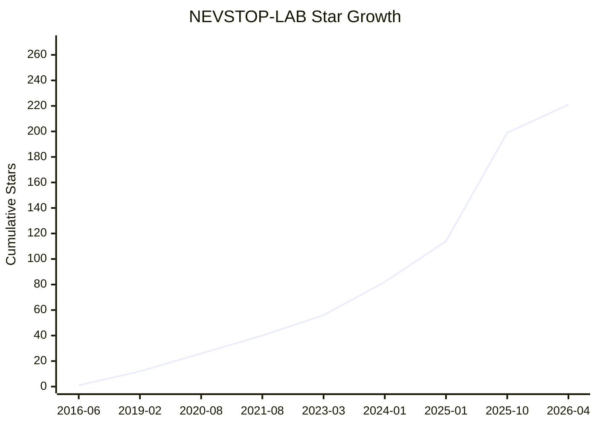

# Star History

_Last updated: 2026-04-14 08:44:59 UTC_  
_Total stars: 254_

## Star Growth Chart

## Top 10 Most Starred Repositories

| Rank | Repository | Stars |
|:----:|:-----------|------:|
| 1 | `Communicable-State-Machine` | 51 |
| 2 | `LabVIEW-UI-XCtl` | 39 |
| 3 | `LabVIEW-GlobalStop-Library` | 13 |
| 4 | `LabVIEW-QuickDrops-Manager` | 11 |
| 5 | `LabVIEW-OPCUA-XML-Library` | 10 |
| 6 | `CSM-Continuous-Meausrement-and-Logging` | 10 |
| 7 | `CSM-Wiki` | 9 |
| 8 | `NEVSTOP-Programming-Palette` | 8 |
| 9 | `CSM-MassData-Parameter-Support` | 8 |
| 10 | `CSM-TCP-Router-App` | 8 |

## Top 10 Users by Stars Given

| Rank | User | Stars Given |
|:----:|:-----|------------:|
| 1 | [DK-666-6](https://github.com/DK-666-6) | 13 |
| 2 | [hanzihua123](https://github.com/hanzihua123) | 13 |
| 3 | [ghwang-Harries](https://github.com/ghwang-Harries) | 11 |
| 4 | [shennnw](https://github.com/shennnw) | 9 |
| 5 | [wyxfhb](https://github.com/wyxfhb) | 8 |
| 6 | [chenwm](https://github.com/chenwm) | 8 |
| 7 | [junyang0412](https://github.com/junyang0412) | 8 |
| 8 | [SallyTYT](https://github.com/SallyTYT) | 5 |
| 9 | [huipeng8](https://github.com/huipeng8) | 4 |
| 10 | [philippe-nuaa](https://github.com/philippe-nuaa) | 4 |

## Star Log

| Time (UTC) | Repository | User | Action |
|:-----------|:-----------|:-----|:------:|
| 2026-04-14 05:04:23 | `CSMScript-Lite` | [eastcheng1024](https://github.com/eastcheng1024) | ⭐ add |
| 2026-04-14 04:14:59 | `CSMScript-Lite` | [ghwang-Harries](https://github.com/ghwang-Harries) | ⭐ add |
| 2026-04-14 02:03:40 | `CSMScript-Lite` | [vanperxx](https://github.com/vanperxx) | ⭐ add |
| 2026-04-14 01:44:38 | `CSMScript-Lite` | [1992yangkun](https://github.com/1992yangkun) | ⭐ add |
| 2026-04-14 01:22:10 | `CSMScript-Lite` | [langrenchangling](https://github.com/langrenchangling) | ⭐ add |
| 2026-04-10 17:26:47 | `LabVIEW-Version-Selector` | [matrixx567](https://github.com/matrixx567) | ⭐ add |
| 2026-04-05 11:52:38 | `Communicable-State-Machine` | [liumc](https://github.com/liumc) | ⭐ add |
| 2026-03-20 18:01:42 | `LabVIEW-UI-XCtl` | [Tang-WeiFeng](https://github.com/Tang-WeiFeng) | ⭐ add |
| 2026-03-20 16:50:27 | `LabVIEW-GlobalStop-Library` | [FatUltraman](https://github.com/FatUltraman) | ⭐ add |
| 2026-03-02 02:21:36 | `LabVIEW-UI-XCtl` | [Foam123](https://github.com/Foam123) | ⭐ add |
| 2026-02-19 02:02:43 | `LabVIEW-UI-XCtl` | [PoliceZ](https://github.com/PoliceZ) | ⭐ add |
| 2026-02-02 03:35:46 | `csm-keynotes-collection` | [wwwymq](https://github.com/wwwymq) | ⭐ add |
| 2026-01-13 07:47:34 | `Communicable-State-Machine` | [kunixYao](https://github.com/kunixYao) | ⭐ add |
| 2026-01-09 13:05:06 | `Communicable-State-Machine` | [SiebenerRepublikII](https://github.com/SiebenerRepublikII) | ⭐ add |
| 2025-12-18 14:55:36 | `Communicable-State-Machine` | [eastcheng1024](https://github.com/eastcheng1024) | ⭐ add |
| 2025-12-13 15:57:26 | `CSM-MassData-Parameter-Support` | [lang-hash](https://github.com/lang-hash) | ⭐ add |
| 2025-12-04 06:33:31 | `Communicable-State-Machine` | [XiaoshuangZhou](https://github.com/XiaoshuangZhou) | ⭐ add |
| 2025-11-20 01:42:47 | `LabVIEW-UI-XCtl` | [996996](https://github.com/996996) | ⭐ add |
| 2025-11-14 06:57:13 | `Communicable-State-Machine` | [lijie19910806-del](https://github.com/lijie19910806-del) | ⭐ add |
| 2025-11-13 11:19:44 | `Communicable-State-Machine` | [chencfy](https://github.com/chencfy) | ⭐ add |
| 2025-11-12 12:59:09 | `NEVSTOP-Programming-Palette` | [Renties](https://github.com/Renties) | ⭐ add |
| 2025-11-05 08:16:38 | `Communicable-State-Machine` | [jlfzhz](https://github.com/jlfzhz) | ⭐ add |
| 2025-10-31 01:15:27 | `Communicable-State-Machine` | [zhongweidi993](https://github.com/zhongweidi993) | ⭐ add |
| 2025-10-28 11:30:12 | `CSM-INI-Static-Variable-Support` | [shennnw](https://github.com/shennnw) | ⭐ add |
| 2025-10-28 11:30:11 | `CSM-Array-Parameter-Support` | [shennnw](https://github.com/shennnw) | ⭐ add |
| 2025-10-28 11:30:10 | `CSM-API-String-Arguments-Support` | [shennnw](https://github.com/shennnw) | ⭐ add |
| 2025-10-28 11:30:09 | `CSM-MassData-Parameter-Support` | [shennnw](https://github.com/shennnw) | ⭐ add |
| 2025-10-28 11:30:08 | `CSM-Icon-Editor-Glyphs` | [shennnw](https://github.com/shennnw) | ⭐ add |
| 2025-10-28 11:30:07 | `CSM-Wiki` | [shennnw](https://github.com/shennnw) | ⭐ add |
| 2025-10-28 11:30:06 | `Communicable-State-Machine` | [shennnw](https://github.com/shennnw) | ⭐ add |
| 2025-10-28 11:30:06 | `CSM-Continuous-Meausrement-and-Logging` | [shennnw](https://github.com/shennnw) | ⭐ add |
| 2025-10-26 10:38:27 | `CSM-TCP-Router-App` | [yangkkokk](https://github.com/yangkkokk) | ⭐ add |
| 2025-10-24 13:22:28 | `Communicable-State-Machine` | [FatUltraman](https://github.com/FatUltraman) | ⭐ add |
| 2025-10-16 14:29:31 | `Communicable-State-Machine` | [langrenchangling](https://github.com/langrenchangling) | ⭐ add |
| 2025-10-11 06:15:51 | `LabVIEW-TagDB` | [wyxfhb](https://github.com/wyxfhb) | ⭐ add |
| 2025-10-10 00:44:14 | `Try-Beta-Version-of-CSMF` | [ghwang-Harries](https://github.com/ghwang-Harries) | ⭐ add |
| 2025-09-23 11:37:16 | `Communicable-State-Machine` | [imthunderbird](https://github.com/imthunderbird) | ⭐ add |
| 2025-09-17 10:21:49 | `CSM-INI-Static-Variable-Support` | [eastcheng1024](https://github.com/eastcheng1024) | ⭐ add |
| 2025-09-15 13:25:41 | `LabVIEW-UI-XCtl` | [lypaser](https://github.com/lypaser) | ⭐ add |
| 2025-09-15 13:24:53 | `NEVSTOP-Programming-Palette` | [lypaser](https://github.com/lypaser) | ⭐ add |
| 2025-09-09 10:00:20 | `Communicable-State-Machine` | [yangkkokk](https://github.com/yangkkokk) | ⭐ add |
| 2025-09-05 13:21:27 | `Communicable-State-Machine` | [liuyang1936](https://github.com/liuyang1936) | ⭐ add |
| 2025-09-05 01:06:35 | `LabVIEW-UI-XCtl` | [cht-ink](https://github.com/cht-ink) | ⭐ add |
| 2025-09-03 06:17:37 | `Communicable-State-Machine` | [zhangfgwis](https://github.com/zhangfgwis) | ⭐ add |
| 2025-09-02 09:40:27 | `Communicable-State-Machine` | [chenwm](https://github.com/chenwm) | ⭐ add |
| 2025-09-01 15:10:36 | `Communicable-State-Machine` | [imeteorite](https://github.com/imeteorite) | ⭐ add |
| 2025-08-27 03:05:55 | `NEVSTOP-LoginWindow` | [Oh-Doo-Yong](https://github.com/Oh-Doo-Yong) | ⭐ add |
| 2025-08-27 02:28:39 | `LabVIEW-UI-XCtl` | [Oh-Doo-Yong](https://github.com/Oh-Doo-Yong) | ⭐ add |
| 2025-08-22 08:55:21 | `CSM-TCP-Router-App` | [liuyang1936](https://github.com/liuyang1936) | ⭐ add |
| 2025-08-21 04:45:04 | `NEVSTOP-LoginWindow` | [WillsHuang2022](https://github.com/WillsHuang2022) | ⭐ add |
| 2025-08-20 02:48:06 | `CSM-Array-Parameter-Support` | [chenwm](https://github.com/chenwm) | ⭐ add |
| 2025-08-20 02:48:05 | `CSM-API-String-Arguments-Support` | [chenwm](https://github.com/chenwm) | ⭐ add |
| 2025-08-20 02:47:58 | `CSM-MassData-Parameter-Support` | [chenwm](https://github.com/chenwm) | ⭐ add |
| 2025-08-20 02:47:56 | `CSM-Icon-Editor-Glyphs` | [chenwm](https://github.com/chenwm) | ⭐ add |
| 2025-08-20 02:47:53 | `CSM-Wiki` | [chenwm](https://github.com/chenwm) | ⭐ add |
| 2025-08-20 02:47:52 | `CSM-Continuous-Meausrement-and-Logging` | [chenwm](https://github.com/chenwm) | ⭐ add |
| 2025-07-27 07:11:44 | `CSM-Continuous-Meausrement-and-Logging` | [ghwang-Harries](https://github.com/ghwang-Harries) | ⭐ add |
| 2025-07-27 07:11:28 | `CSM-TCP-Router-App` | [ghwang-Harries](https://github.com/ghwang-Harries) | ⭐ add |
| 2025-07-27 07:10:47 | `CSM-INI-Static-Variable-Support` | [ghwang-Harries](https://github.com/ghwang-Harries) | ⭐ add |
| 2025-07-27 07:10:28 | `CSM-API-String-Arguments-Support` | [ghwang-Harries](https://github.com/ghwang-Harries) | ⭐ add |
| 2025-07-27 07:10:19 | `CSM-MassData-Parameter-Support` | [ghwang-Harries](https://github.com/ghwang-Harries) | ⭐ add |
| 2025-07-27 06:55:58 | `NEVSTOP-Programming-Palette` | [ghwang-Harries](https://github.com/ghwang-Harries) | ⭐ add |
| 2025-07-27 06:52:28 | `CSM-Icon-Editor-Glyphs` | [ghwang-Harries](https://github.com/ghwang-Harries) | ⭐ add |
| 2025-07-27 06:51:51 | `Communicable-State-Machine` | [ghwang-Harries](https://github.com/ghwang-Harries) | ⭐ add |
| 2025-07-27 06:41:17 | `CSM-ModSets-FileSync` | [ghwang-Harries](https://github.com/ghwang-Harries) | ⭐ add |
| 2025-07-22 10:25:38 | `NEVSTOP-Programming-Palette` | [Ali6114](https://github.com/Ali6114) | ⭐ add |
| 2025-07-06 07:39:25 | `Communicable-State-Machine` | [1003727982](https://github.com/1003727982) | ⭐ add |
| 2025-07-04 01:01:01 | `LabVIEW-UI-XCtl` | [Automan-wfq](https://github.com/Automan-wfq) | ⭐ add |
| 2025-06-28 16:10:59 | `NEVSTOP-LoginWindow` | [IkunYoung](https://github.com/IkunYoung) | ⭐ add |
| 2025-06-28 16:03:47 | `CSM-TCP-Router-App` | [IkunYoung](https://github.com/IkunYoung) | ⭐ add |
| 2025-06-25 12:09:47 | `Communicable-State-Machine` | [smileJF](https://github.com/smileJF) | ⭐ add |
| 2025-06-16 21:40:04 | `CSM-Wiki` | [IkunYoung](https://github.com/IkunYoung) | ⭐ add |
| 2025-06-16 07:51:06 | `Communicable-State-Machine` | [coyote259](https://github.com/coyote259) | ⭐ add |
| 2025-06-15 12:42:46 | `Communicable-State-Machine` | [1992yangkun](https://github.com/1992yangkun) | ⭐ add |
| 2025-06-11 05:32:06 | `CSM-ModSets-FileSync` | [wyxfhb](https://github.com/wyxfhb) | ⭐ add |
| 2025-06-11 00:17:22 | `CSM-ModSets-FileSync` | [huipeng8](https://github.com/huipeng8) | ⭐ add |
| 2025-06-09 01:08:36 | `Communicable-State-Machine` | [wwwymq](https://github.com/wwwymq) | ⭐ add |
| 2025-06-03 22:49:42 | `LabVIEW-QuickDrops-Manager` | [lypaser](https://github.com/lypaser) | ⭐ add |
| 2025-05-29 08:07:56 | `Communicable-State-Machine` | [2279790684](https://github.com/2279790684) | ⭐ add |
| 2025-05-29 05:46:49 | `NEVSTOP-LoginWindow` | [Router0824](https://github.com/Router0824) | ⭐ add |
| 2025-05-25 16:18:51 | `Communicable-State-Machine` | [willemLam](https://github.com/willemLam) | ⭐ add |
| 2025-05-16 16:07:39 | `CSM-TCP-Router-App` | [DK-666-6](https://github.com/DK-666-6) | ⭐ add |
| 2025-05-16 16:06:05 | `csm-keynotes-collection` | [DK-666-6](https://github.com/DK-666-6) | ⭐ add |
| 2025-05-16 16:06:03 | `CSM-Helper-Development` | [DK-666-6](https://github.com/DK-666-6) | ⭐ add |
| 2025-05-16 16:06:02 | `CSM-Benchmark` | [DK-666-6](https://github.com/DK-666-6) | ⭐ add |
| 2025-05-16 16:06:01 | `CSM-Array-Parameter-Support` | [DK-666-6](https://github.com/DK-666-6) | ⭐ add |
| 2025-05-16 16:06:00 | `CSM-API-String-Arguments-Support` | [DK-666-6](https://github.com/DK-666-6) | ⭐ add |
| 2025-05-16 16:05:59 | `CSM-INI-Static-Variable-Support` | [DK-666-6](https://github.com/DK-666-6) | ⭐ add |
| 2025-05-16 16:05:58 | `CSM-MassData-Parameter-Support` | [DK-666-6](https://github.com/DK-666-6) | ⭐ add |
| 2025-05-16 16:05:56 | `CSM-Mermaid-Plugin` | [DK-666-6](https://github.com/DK-666-6) | ⭐ add |
| 2025-05-16 16:05:53 | `CSM-Icon-Editor-Glyphs` | [DK-666-6](https://github.com/DK-666-6) | ⭐ add |
| 2025-05-16 16:05:52 | `CSM-Wiki` | [DK-666-6](https://github.com/DK-666-6) | ⭐ add |
| 2025-05-16 16:05:50 | `Communicable-State-Machine` | [DK-666-6](https://github.com/DK-666-6) | ⭐ add |
| 2025-05-16 16:05:43 | `CSM-Continuous-Meausrement-and-Logging` | [DK-666-6](https://github.com/DK-666-6) | ⭐ add |
| 2025-04-29 10:59:01 | `CSM-INI-Static-Variable-Support` | [wulei2LabVIEW](https://github.com/wulei2LabVIEW) | ⭐ add |
| 2025-04-25 10:52:48 | `LabVIEW-TDMS-Viewer` | [qwtel](https://github.com/qwtel) | ⭐ add |
| 2025-04-25 08:45:14 | `LabVIEW-QuickDrops-Manager` | [srilogesh](https://github.com/srilogesh) | ⭐ add |
| 2025-04-19 05:14:35 | `LabVIEW-TagDB` | [teatreeoil](https://github.com/teatreeoil) | ⭐ add |
| 2025-04-14 07:07:15 | `Communicable-State-Machine` | [Freddd13](https://github.com/Freddd13) | ⭐ add |
| 2025-03-28 16:11:42 | `Communicable-State-Machine` | [Mendle](https://github.com/Mendle) | ⭐ add |
| 2025-03-26 04:19:45 | `NEVSTOP-LoginWindow` | [junyang0412](https://github.com/junyang0412) | ⭐ add |
| 2025-03-26 04:19:36 | `CSM-TCP-Router-App` | [junyang0412](https://github.com/junyang0412) | ⭐ add |
| 2025-03-26 04:19:29 | `CSM-Mermaid-Plugin` | [junyang0412](https://github.com/junyang0412) | ⭐ add |
| 2025-03-26 04:19:03 | `CSM-Continuous-Meausrement-and-Logging` | [junyang0412](https://github.com/junyang0412) | ⭐ add |
| 2025-03-26 04:17:47 | `lvCICD` | [junyang0412](https://github.com/junyang0412) | ⭐ add |
| 2025-02-16 09:31:45 | `LabVIEW-GlobalStop-Library` | [etfovac](https://github.com/etfovac) | ⭐ add |
| 2025-02-11 11:51:45 | `LabVIEW-UI-XCtl` | [0070707](https://github.com/0070707) | ⭐ add |
| 2025-01-19 23:44:56 | `LabVIEW-UI-XCtl` | [Richi-Wu](https://github.com/Richi-Wu) | ⭐ add |
| 2025-01-19 16:20:17 | `LabVIEW-UI-XCtl` | [NIHAO12128](https://github.com/NIHAO12128) | ⭐ add |
| 2025-01-14 11:05:38 | `TestStand-User-Interface-Messages-Demo` | [chenshuihong](https://github.com/chenshuihong) | ⭐ add |
| 2025-01-03 21:16:52 | `Communicable-State-Machine` | [etfovac](https://github.com/etfovac) | ⭐ add |
| 2025-01-03 04:10:08 | `CSM-Continuous-Meausrement-and-Logging` | [wyxfhb](https://github.com/wyxfhb) | ⭐ add |
| 2025-01-03 04:09:58 | `Communicable-State-Machine` | [wyxfhb](https://github.com/wyxfhb) | ⭐ add |
| 2024-12-31 17:08:24 | `LabVIEW-UI-XCtl` | [NashShen](https://github.com/NashShen) | ⭐ add |
| 2024-12-20 16:45:08 | `NEVSTOP-3rdParty-Dependencies` | [ervinjay](https://github.com/ervinjay) | ⭐ add |
| 2024-12-07 13:06:13 | `Communicable-State-Machine` | [QingNing3028](https://github.com/QingNing3028) | ⭐ add |
| 2024-11-13 07:56:46 | `Communicable-State-Machine` | [luferau](https://github.com/luferau) | ⭐ add |
| 2024-11-12 05:59:18 | `Communicable-State-Machine` | [gaoruhao](https://github.com/gaoruhao) | ⭐ add |
| 2024-11-07 08:42:49 | `Communicable-State-Machine` | [xuyuandao](https://github.com/xuyuandao) | ⭐ add |
| 2024-10-22 14:21:48 | `labview_win_util32` | [fisothemes](https://github.com/fisothemes) | ⭐ add |
| 2024-10-16 06:45:03 | `LabVIEW-Multiwork-Thread-Example` | [junyang0412](https://github.com/junyang0412) | ⭐ add |
| 2024-10-16 06:44:21 | `LabVIEW-TimerEngine` | [junyang0412](https://github.com/junyang0412) | ⭐ add |
| 2024-10-16 06:31:03 | `Communicable-State-Machine` | [junyang0412](https://github.com/junyang0412) | ⭐ add |
| 2024-08-01 20:50:34 | `CSM-Continuous-Meausrement-and-Logging` | [Jend4s](https://github.com/Jend4s) | ⭐ add |
| 2024-08-01 01:29:06 | `LabVIEW-UI-XCtl` | [wyxfhb](https://github.com/wyxfhb) | ⭐ add |
| 2024-06-28 11:46:35 | `CSM-Icon-Editor-Glyphs` | [achuthaperumal](https://github.com/achuthaperumal) | ⭐ add |
| 2024-06-28 09:39:48 | `CSM-Icon-Editor-Glyphs` | [AntoineChalons](https://github.com/AntoineChalons) | ⭐ add |
| 2024-06-19 07:21:04 | `LabVIEW-UI-XCtl` | [chenduxiu01](https://github.com/chenduxiu01) | ⭐ add |
| 2024-05-30 14:37:44 | `CSM-Continuous-Meausrement-and-Logging` | [hanzihua123](https://github.com/hanzihua123) | ⭐ add |
| 2024-05-30 14:37:15 | `CSM-Wiki` | [hanzihua123](https://github.com/hanzihua123) | ⭐ add |
| 2024-05-14 00:33:00 | `CSM-Mermaid-Plugin` | [hanzihua123](https://github.com/hanzihua123) | ⭐ add |
| 2024-05-10 01:25:35 | `Communicable-State-Machine` | [DongqingHai](https://github.com/DongqingHai) | ⭐ add |
| 2024-05-08 01:22:58 | `Communicable-State-Machine` | [httpashu](https://github.com/httpashu) | ⭐ add |
| 2024-04-24 01:22:57 | `LabVIEW-Program-run-on-startup` | [hanzihua123](https://github.com/hanzihua123) | ⭐ add |
| 2024-04-24 01:14:51 | `Communicable-State-Machine` | [hanzihua123](https://github.com/hanzihua123) | ⭐ add |
| 2024-04-22 22:37:44 | `Communicable-State-Machine` | [bigbirdone](https://github.com/bigbirdone) | ⭐ add |
| 2024-04-09 08:44:38 | `LabVIEW-UI-XCtl` | [JohnJiangsong](https://github.com/JohnJiangsong) | ⭐ add |
| 2024-04-09 08:39:50 | `Communicable-State-Machine` | [JohnJiangsong](https://github.com/JohnJiangsong) | ⭐ add |
| 2024-03-20 07:30:38 | `LabVIEW-QuickDrops-Manager` | [hanzihua123](https://github.com/hanzihua123) | ⭐ add |
| 2024-01-09 23:18:25 | `NEVSTOP-LoginWindow` | [hanzihua123](https://github.com/hanzihua123) | ⭐ add |
| 2024-01-09 14:31:43 | `LabVIEW-UI-XCtl` | [okoscielny](https://github.com/okoscielny) | ⭐ add |
| 2024-01-08 16:51:24 | `CSM-Wiki` | [jordanmsmith](https://github.com/jordanmsmith) | ⭐ add |
| 2023-12-22 09:09:12 | `Communicable-State-Machine` | [YunhuaLiu](https://github.com/YunhuaLiu) | ⭐ add |
| 2023-12-03 15:04:45 | `NEVSTOP-Programming-Palette` | [Alvin2110](https://github.com/Alvin2110) | ⭐ add |
| 2023-11-15 13:57:46 | `Communicable-State-Machine` | [YangZeCN](https://github.com/YangZeCN) | ⭐ add |
| 2023-10-27 09:03:25 | `labview_win_util32` | [LJS006](https://github.com/LJS006) | ⭐ add |
| 2023-10-06 16:03:31 | `CSM-Benchmark` | [philippe-nuaa](https://github.com/philippe-nuaa) | ⭐ add |
| 2023-10-06 16:03:03 | `CSM-MassData-Parameter-Support` | [philippe-nuaa](https://github.com/philippe-nuaa) | ⭐ add |
| 2023-10-06 16:02:31 | `Communicable-State-Machine` | [philippe-nuaa](https://github.com/philippe-nuaa) | ⭐ add |
| 2023-10-06 16:00:19 | `LabVIEW-UI-XCtl` | [philippe-nuaa](https://github.com/philippe-nuaa) | ⭐ add |
| 2023-09-11 01:21:17 | `LabVIEW-OPCUA-XML-Library` | [Happiness188](https://github.com/Happiness188) | ⭐ add |
| 2023-09-09 08:51:28 | `LabVIEW-TDMS-Viewer` | [hanzihua123](https://github.com/hanzihua123) | ⭐ add |
| 2023-09-09 08:50:54 | `LabVIEW-TimerEngine` | [hanzihua123](https://github.com/hanzihua123) | ⭐ add |
| 2023-09-09 08:50:08 | `LabVIEW-Stop-Signal` | [hanzihua123](https://github.com/hanzihua123) | ⭐ add |
| 2023-09-09 08:49:48 | `LabVIEW-Multiwork-Thread-Example` | [hanzihua123](https://github.com/hanzihua123) | ⭐ add |
| 2023-09-09 08:49:14 | `NEVSTOP-Programming-Palette` | [hanzihua123](https://github.com/hanzihua123) | ⭐ add |
| 2023-08-12 12:28:17 | `CSM-Array-Parameter-Support` | [awolpe](https://github.com/awolpe) | ⭐ add |
| 2023-08-11 00:07:01 | `Communicable-State-Machine` | [huipeng8](https://github.com/huipeng8) | ⭐ add |
| 2023-08-10 02:06:50 | `Communicable-State-Machine` | [DesBegonia](https://github.com/DesBegonia) | ⭐ add |
| 2023-08-02 03:01:42 | `Communicable-State-Machine` | [SallyTYT](https://github.com/SallyTYT) | ⭐ add |
| 2023-07-31 03:46:55 | `Communicable-State-Machine` | [ManGie2234](https://github.com/ManGie2234) | ⭐ add |
| 2023-07-20 08:26:40 | `LabVIEW-MassData-Smart-Ptr` | [SallyTYT](https://github.com/SallyTYT) | ⭐ add |
| 2023-07-20 01:13:36 | `NEVSTOP-Programming-Palette` | [awolpe](https://github.com/awolpe) | ⭐ add |
| 2023-05-01 15:19:10 | `LabVIEW-OPCUA-XML-Library` | [nikristovski](https://github.com/nikristovski) | ⭐ add |
| 2023-04-06 06:47:23 | `LabVIEW-OPCUA-XML-Library` | [soulhacker786](https://github.com/soulhacker786) | ⭐ add |
| 2023-03-13 12:50:14 | `LabVIEW-GlobalStop-Library` | [SallyTYT](https://github.com/SallyTYT) | ⭐ add |
| 2023-03-04 14:46:07 | `LabVIEW-UI-XCtl` | [Youngenwang](https://github.com/Youngenwang) | ⭐ add |
| 2022-12-25 08:50:03 | `LabVIEW-QuickDrops-Manager` | [LVStudy2YC](https://github.com/LVStudy2YC) | ⭐ add |
| 2022-12-23 10:03:51 | `LabVIEW-QuickDrops-Manager` | [clan4456](https://github.com/clan4456) | ⭐ add |
| 2022-12-23 10:02:43 | `LabVIEW-QuickDrops-Manager` | [tjuspring](https://github.com/tjuspring) | ⭐ add |
| 2022-12-14 22:52:25 | `LabVIEW-QuickDrops-Manager` | [TheDomcio](https://github.com/TheDomcio) | ⭐ add |
| 2022-12-09 03:42:14 | `LabVIEW-UI-XCtl` | [LeafLhh](https://github.com/LeafLhh) | ⭐ add |
| 2022-11-11 09:42:04 | `LabVIEW-TimerEngine` | [SallyTYT](https://github.com/SallyTYT) | ⭐ add |
| 2022-09-15 17:01:16 | `LabVIEW-GlobalStop-Library` | [ericddm](https://github.com/ericddm) | ⭐ add |
| 2022-09-15 16:59:46 | `LabVIEW-OPCUA-XML-Library` | [ericddm](https://github.com/ericddm) | ⭐ add |
| 2022-07-19 10:31:17 | `LabVIEW-GlobalStop-Library` | [babyfly](https://github.com/babyfly) | ⭐ add |
| 2022-07-13 09:15:39 | `LabVIEW-OPCUA-XML-Library` | [dat422](https://github.com/dat422) | ⭐ add |
| 2022-06-27 11:36:18 | `LabVIEW-UI-XCtl` | [LVJo](https://github.com/LVJo) | ⭐ add |
| 2022-05-20 21:17:21 | `LabVIEW-OPCUA-XML-Library` | [davtrs](https://github.com/davtrs) | ⭐ add |
| 2022-02-28 15:35:50 | `mqtt-LabVIEW` | [FansenZhao](https://github.com/FansenZhao) | ⭐ add |
| 2021-12-01 15:10:18 | `mqtt-LabVIEW` | [eliauk-code](https://github.com/eliauk-code) | ⭐ add |
| 2021-08-19 16:46:25 | `LabVIEW-GlobalStop-Library` | [hanzihua123](https://github.com/hanzihua123) | ⭐ add |
| 2021-07-02 09:17:38 | `LabVIEW-UI-XCtl` | [Agilentvee](https://github.com/Agilentvee) | ⭐ add |
| 2021-06-11 05:58:49 | `LabVIEW-UI-XCtl` | [shennnw](https://github.com/shennnw) | ⭐ add |
| 2021-05-06 16:49:35 | `LabVIEW-MassData-Smart-Ptr` | [ericddm](https://github.com/ericddm) | ⭐ add |
| 2021-05-06 16:44:07 | `LabVIEW-UI-XCtl` | [ericddm](https://github.com/ericddm) | ⭐ add |
| 2021-04-24 15:21:48 | `LabVIEW-UI-XCtl` | [Zhu-Hai](https://github.com/Zhu-Hai) | ⭐ add |
| 2021-04-13 14:11:36 | `LabVIEW-GlobalStop-Library` | [Cikmar](https://github.com/Cikmar) | ⭐ add |
| 2021-04-08 02:29:17 | `LabVIEW-QuickDrops-Manager` | [wyxfhb](https://github.com/wyxfhb) | ⭐ add |
| 2021-04-08 02:28:29 | `LabVIEW-OPCUA-XML-Library` | [wyxfhb](https://github.com/wyxfhb) | ⭐ add |
| 2021-04-08 02:26:29 | `LabVIEW-GlobalStop-Library` | [wyxfhb](https://github.com/wyxfhb) | ⭐ add |
| 2021-03-19 06:07:17 | `LabVIEW-UI-XCtl` | [dammstanger](https://github.com/dammstanger) | ⭐ add |
| 2021-01-31 07:19:36 | `LabVIEW-UI-XCtl` | [myitb1234](https://github.com/myitb1234) | ⭐ add |
| 2020-12-11 09:27:22 | `LabVIEW-UI-XCtl` | [AxxOoOxxA](https://github.com/AxxOoOxxA) | ⭐ add |
| 2020-10-26 06:12:41 | `LabVIEW-UI-XCtl` | [clan4456](https://github.com/clan4456) | ⭐ add |
| 2020-08-30 08:49:00 | `mqtt-LabVIEW` | [XudongZhao-Iecube](https://github.com/XudongZhao-Iecube) | ⭐ add |
| 2020-06-29 16:10:56 | `LabVIEW-UI-XCtl` | [gilbertpan1](https://github.com/gilbertpan1) | ⭐ add |
| 2020-06-28 08:36:55 | `LabVIEW-QuickDrops-Manager` | [SallyTYT](https://github.com/SallyTYT) | ⭐ add |
| 2020-06-20 00:25:38 | `LabVIEW-UI-XMSChart` | [Setchange](https://github.com/Setchange) | ⭐ add |
| 2020-05-29 18:56:34 | `LabVIEW-UI-XCtl` | [liaobuqixiaozhai](https://github.com/liaobuqixiaozhai) | ⭐ add |
| 2020-05-27 14:05:17 | `LabVIEW-UI-XCtl` | [chenshi571](https://github.com/chenshi571) | ⭐ add |
| 2020-05-19 03:21:34 | `LabVIEW-QuickDrops-Manager` | [neo618](https://github.com/neo618) | ⭐ add |
| 2020-04-04 15:15:20 | `LabVIEW-UI-XCtl` | [Setchange](https://github.com/Setchange) | ⭐ add |
| 2020-03-01 07:35:04 | `LabVIEW-OPCUA-XML-Library` | [leonie2020](https://github.com/leonie2020) | ⭐ add |
| 2020-03-01 07:33:31 | `LabVIEW-UI-XCtl` | [leonie2020](https://github.com/leonie2020) | ⭐ add |
| 2020-01-03 16:07:10 | `LabVIEW-OPCUA-XML-Library` | [traversaro](https://github.com/traversaro) | ⭐ add |
| 2019-12-07 15:05:44 | `LabVIEW-UI-XCtl` | [Rashid-Malik](https://github.com/Rashid-Malik) | ⭐ add |
| 2019-08-28 00:07:43 | `LabVIEW-MassData-Smart-Ptr` | [wogeguaiguai](https://github.com/wogeguaiguai) | ⭐ add |
| 2019-04-14 17:05:13 | `LabVIEW-UI-XCtl` | [dealwood](https://github.com/dealwood) | ⭐ add |
| 2019-02-16 06:42:44 | `LabVIEW-UI-XCtl` | [danaherzx](https://github.com/danaherzx) | ⭐ add |
| 2018-11-23 09:40:41 | `LabVIEW-GlobalStop-Library` | [willywf](https://github.com/willywf) | ⭐ add |
| 2018-09-09 00:42:26 | `LabVIEW-UI-XCtl` | [LeeGaning](https://github.com/LeeGaning) | ⭐ add |
| 2018-06-18 06:15:13 | `LabVIEW-GlobalStop-Library` | [MIDHUNRAJS](https://github.com/MIDHUNRAJS) | ⭐ add |
| 2018-05-01 14:49:39 | `LabVIEW-UI-XMSChart` | [Zhu-Hai](https://github.com/Zhu-Hai) | ⭐ add |
| 2018-04-13 02:27:42 | `LabVIEW-GlobalStop-Library` | [caesar93](https://github.com/caesar93) | ⭐ add |
| 2018-03-10 12:51:35 | `LabVIEW-TDMS-Viewer` | [mstroehle](https://github.com/mstroehle) | ⭐ add |
| 2018-03-10 12:50:53 | `LabVIEW-GlobalStop-Library` | [mstroehle](https://github.com/mstroehle) | ⭐ add |
| 2018-01-09 18:25:53 | `LabVIEW-OPCUA-XML-Library` | [jacobmathews](https://github.com/jacobmathews) | ⭐ add |
| 2017-11-23 00:34:16 | `LabVIEW-UI-XMSChart` | [huipeng8](https://github.com/huipeng8) | ⭐ add |
| 2017-11-08 12:04:00 | `LabVIEW-UI-XCtl` | [huipeng8](https://github.com/huipeng8) | ⭐ add |
| 2016-06-02 10:00:04 | `LabVIEW-GlobalStop-Library` | [chenwm](https://github.com/chenwm) | ⭐ add |
