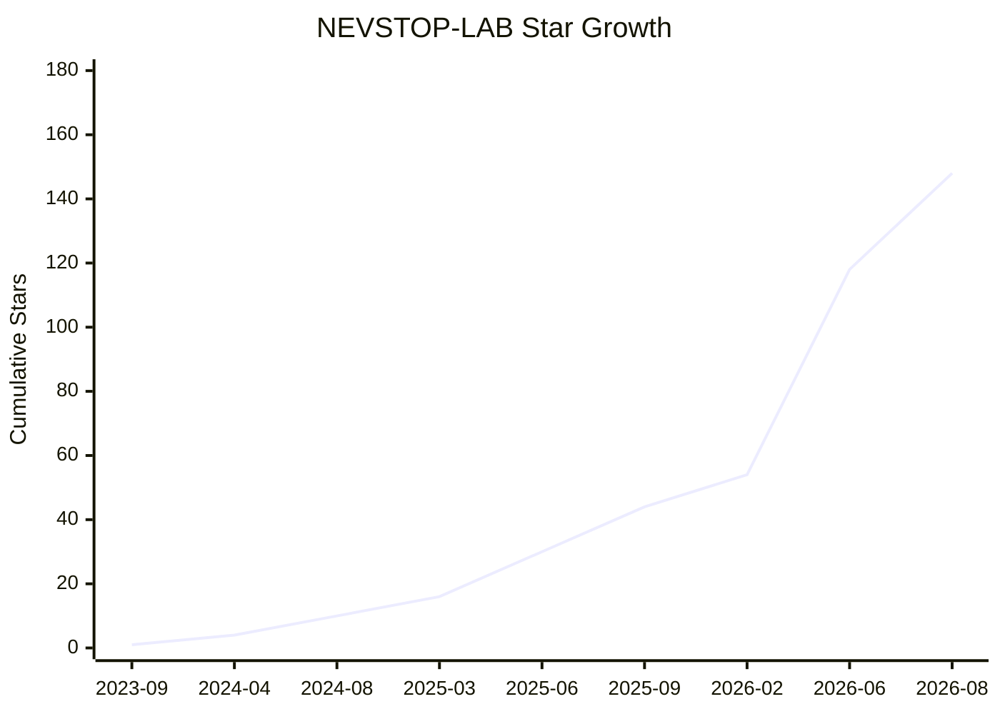

# Star History

_Last updated: 2026-08-18 00:15:37 UTC+8_  
_Total stars: 178_

## Star Growth Chart

```mermaid
xychart-beta
    title "NEVSTOP-LAB Star Growth"
    x-axis ["2023-09", "2024-04", "2024-08", "2025-03", "2025-06", "2025-09", "2026-02", "2026-06", "2026-08"]
    y-axis "Cumulative Stars" 0 --> 180
    line [1, 4, 10, 16, 30, 44, 54, 118, 148]
```

## Top 10 Most Starred Repositories

| Rank | Repository | Stars |
|:----:|:-----------|------:|
| 1 | [`CSMScript-Lite`](https://github.com/NEVSTOP-LAB/CSMScript-Lite) | 29 |
| 2 | [`CSM-MassData-Parameter-Support`](https://github.com/NEVSTOP-LAB/CSM-MassData-Parameter-Support) | 17 |
| 3 | [`CSM-INI-Static-Variable-Support`](https://github.com/NEVSTOP-LAB/CSM-INI-Static-Variable-Support) | 15 |
| 4 | [`CSM-API-String-Arguments-Support`](https://github.com/NEVSTOP-LAB/CSM-API-String-Arguments-Support) | 14 |
| 5 | [`CSM-Continuous-Meausrement-and-Logging`](https://github.com/NEVSTOP-LAB/CSM-Continuous-Meausrement-and-Logging) | 11 |
| 6 | [`CSM-TCP-Router-App`](https://github.com/NEVSTOP-LAB/CSM-TCP-Router-App) | 11 |
| 7 | [`CSM-Wiki`](https://github.com/NEVSTOP-LAB/CSM-Wiki) | 9 |
| 8 | [`CSM-ModSets-FileSync`](https://github.com/NEVSTOP-LAB/CSM-ModSets-FileSync) | 8 |
| 9 | [`CSM-ModSets-SplashWindow`](https://github.com/NEVSTOP-LAB/CSM-ModSets-SplashWindow) | 8 |
| 10 | [`CSM-Modsets-WaveformDisplay`](https://github.com/NEVSTOP-LAB/CSM-Modsets-WaveformDisplay) | 8 |

## Top 10 Users by Stars Given

| Rank | User | Stars Given |
|:----:|:-----|------------:|
| 1 | [ghwang-Harries](https://github.com/ghwang-Harries) | 15 |
| 2 | [datadataup](https://github.com/datadataup) | 14 |
| 3 | [chenjingfang123](https://github.com/chenjingfang123) | 10 |
| 4 | [DK-666-6](https://github.com/DK-666-6) | 10 |
| 5 | [highland-gy](https://github.com/highland-gy) | 9 |
| 6 | [shennnw](https://github.com/shennnw) | 6 |
| 7 | [chenwm](https://github.com/chenwm) | 5 |
| 8 | [hanzihua123](https://github.com/hanzihua123) | 5 |
| 9 | [MySU1](https://github.com/MySU1) | 4 |
| 10 | [paynechen521](https://github.com/paynechen521) | 4 |

## Star Log

| Time (UTC+8) | Repository | User | Action |
|:-----------|:-----------|:-----|:------:|
| 2026-08-11 15:33:40+08:00 | [`csm-keynotes-collection`](https://github.com/NEVSTOP-LAB/csm-keynotes-collection) | [tsaibing](https://github.com/tsaibing) | ⭐ add |
| 2026-08-09 17:19:41+08:00 | [`csm-vsc-extension`](https://github.com/NEVSTOP-LAB/csm-vsc-extension) | [lypaser](https://github.com/lypaser) | ⭐ add |
| 2026-07-31 15:49:28+08:00 | [`CSMScript-Lite`](https://github.com/NEVSTOP-LAB/CSMScript-Lite) | [highland-gy](https://github.com/highland-gy) | ⭐ add |
| 2026-07-31 15:49:27+08:00 | [`CSM-TCP-Router-App`](https://github.com/NEVSTOP-LAB/CSM-TCP-Router-App) | [highland-gy](https://github.com/highland-gy) | ⭐ add |
| 2026-07-31 15:49:26+08:00 | [`CSM-Modsets-WaveformDisplay`](https://github.com/NEVSTOP-LAB/CSM-Modsets-WaveformDisplay) | [highland-gy](https://github.com/highland-gy) | ⭐ add |
| 2026-07-31 15:49:25+08:00 | [`CSM-ModSets-TagRouter`](https://github.com/NEVSTOP-LAB/CSM-ModSets-TagRouter) | [highland-gy](https://github.com/highland-gy) | ⭐ add |
| 2026-07-31 15:49:24+08:00 | [`CSM-ModSets-TagDB-UI`](https://github.com/NEVSTOP-LAB/CSM-ModSets-TagDB-UI) | [highland-gy](https://github.com/highland-gy) | ⭐ add |
| 2026-07-31 15:49:23+08:00 | [`CSM-ModSets-SplashWindow`](https://github.com/NEVSTOP-LAB/CSM-ModSets-SplashWindow) | [highland-gy](https://github.com/highland-gy) | ⭐ add |
| 2026-07-31 15:49:21+08:00 | [`CSM-Modsets-ScheduledCmdWindow`](https://github.com/NEVSTOP-LAB/CSM-Modsets-ScheduledCmdWindow) | [highland-gy](https://github.com/highland-gy) | ⭐ add |
| 2026-07-24 23:17:38+08:00 | [`CSMScript-Lite`](https://github.com/NEVSTOP-LAB/CSMScript-Lite) | [Renties](https://github.com/Renties) | ⭐ add |
| 2026-07-22 15:11:45+08:00 | [`CSM-ModSets-FileSync`](https://github.com/NEVSTOP-LAB/CSM-ModSets-FileSync) | [highland-gy](https://github.com/highland-gy) | ⭐ add |
| 2026-07-22 15:11:45+08:00 | [`CSM-Module-Repo-Template`](https://github.com/NEVSTOP-LAB/CSM-Module-Repo-Template) | [highland-gy](https://github.com/highland-gy) | ⭐ add |
| 2026-07-16 10:37:19+08:00 | [`CSM-INI-Static-Variable-Support`](https://github.com/NEVSTOP-LAB/CSM-INI-Static-Variable-Support) | [datadataup](https://github.com/datadataup) | ⭐ add |
| 2026-07-16 10:37:14+08:00 | [`CSM-MassData-Parameter-Support`](https://github.com/NEVSTOP-LAB/CSM-MassData-Parameter-Support) | [datadataup](https://github.com/datadataup) | ⭐ add |
| 2026-07-16 10:37:10+08:00 | [`CSM-API-String-Arguments-Support`](https://github.com/NEVSTOP-LAB/CSM-API-String-Arguments-Support) | [datadataup](https://github.com/datadataup) | ⭐ add |
| 2026-07-15 20:25:56+08:00 | [`CSM-ModSets-DAQmx`](https://github.com/NEVSTOP-LAB/CSM-ModSets-DAQmx) | [MySU1](https://github.com/MySU1) | ⭐ add |
| 2026-07-10 22:44:53+08:00 | [`CSM-INI-Static-Variable-Support`](https://github.com/NEVSTOP-LAB/CSM-INI-Static-Variable-Support) | [MySU1](https://github.com/MySU1) | ⭐ add |
| 2026-07-10 22:44:48+08:00 | [`CSM-MassData-Parameter-Support`](https://github.com/NEVSTOP-LAB/CSM-MassData-Parameter-Support) | [MySU1](https://github.com/MySU1) | ⭐ add |
| 2026-07-10 22:44:35+08:00 | [`CSM-API-String-Arguments-Support`](https://github.com/NEVSTOP-LAB/CSM-API-String-Arguments-Support) | [MySU1](https://github.com/MySU1) | ⭐ add |
| 2026-07-07 16:52:03+08:00 | [`CSMScript-Lite`](https://github.com/NEVSTOP-LAB/CSMScript-Lite) | [huipeng8](https://github.com/huipeng8) | ⭐ add |
| 2026-07-07 16:14:40+08:00 | [`LabVIEW-Hashlib`](https://github.com/NEVSTOP-LAB/LabVIEW-Hashlib) | [datadataup](https://github.com/datadataup) | ⭐ add |
| 2026-07-04 15:20:43+08:00 | [`CSM-TCP-Router-App`](https://github.com/NEVSTOP-LAB/CSM-TCP-Router-App) | [datadataup](https://github.com/datadataup) | ⭐ add |
| 2026-07-04 15:20:42+08:00 | [`CSM-Module-Repo-Template`](https://github.com/NEVSTOP-LAB/CSM-Module-Repo-Template) | [datadataup](https://github.com/datadataup) | ⭐ add |
| 2026-07-04 15:20:41+08:00 | [`CSM-Modsets-ScheduledCmdWindow`](https://github.com/NEVSTOP-LAB/CSM-Modsets-ScheduledCmdWindow) | [datadataup](https://github.com/datadataup) | ⭐ add |
| 2026-07-04 10:44:01+08:00 | [`CSM-ModSets-FileSync`](https://github.com/NEVSTOP-LAB/CSM-ModSets-FileSync) | [datadataup](https://github.com/datadataup) | ⭐ add |
| 2026-07-02 16:21:03+08:00 | [`G-Web-Development-with-CSM`](https://github.com/NEVSTOP-LAB/G-Web-Development-with-CSM) | [datadataup](https://github.com/datadataup) | ⭐ add |
| 2026-07-02 16:21:00+08:00 | [`csm-vsc-extension`](https://github.com/NEVSTOP-LAB/csm-vsc-extension) | [datadataup](https://github.com/datadataup) | ⭐ add |
| 2026-07-01 16:49:38+08:00 | [`CSM-INI-Static-Variable-Support`](https://github.com/NEVSTOP-LAB/CSM-INI-Static-Variable-Support) | [chenjingfang123](https://github.com/chenjingfang123) | ⭐ add |
| 2026-07-01 16:49:36+08:00 | [`CSM-MassData-Parameter-Support`](https://github.com/NEVSTOP-LAB/CSM-MassData-Parameter-Support) | [chenjingfang123](https://github.com/chenjingfang123) | ⭐ add |
| 2026-07-01 16:49:34+08:00 | [`CSM-API-String-Arguments-Support`](https://github.com/NEVSTOP-LAB/CSM-API-String-Arguments-Support) | [chenjingfang123](https://github.com/chenjingfang123) | ⭐ add |
| 2026-06-30 16:04:44+08:00 | [`CSMScript-Lite`](https://github.com/NEVSTOP-LAB/CSMScript-Lite) | [datadataup](https://github.com/datadataup) | ⭐ add |
| 2026-06-30 00:57:37+08:00 | [`CSMScript-Lite`](https://github.com/NEVSTOP-LAB/CSMScript-Lite) | [Wuliuqi0529](https://github.com/Wuliuqi0529) | ❌ delete |
| 2026-06-29 14:16:48+08:00 | [`CSMScript-Lite`](https://github.com/NEVSTOP-LAB/CSMScript-Lite) | [chenjingfang123](https://github.com/chenjingfang123) | ⭐ add |
| 2026-06-29 14:16:46+08:00 | [`CSM-TCP-Router-App`](https://github.com/NEVSTOP-LAB/CSM-TCP-Router-App) | [chenjingfang123](https://github.com/chenjingfang123) | ⭐ add |
| 2026-06-29 14:16:46+08:00 | [`CSM-Module-Repo-Template`](https://github.com/NEVSTOP-LAB/CSM-Module-Repo-Template) | [chenjingfang123](https://github.com/chenjingfang123) | ⭐ add |
| 2026-06-29 14:16:45+08:00 | [`CSM-ModSets-TagRouter`](https://github.com/NEVSTOP-LAB/CSM-ModSets-TagRouter) | [chenjingfang123](https://github.com/chenjingfang123) | ⭐ add |
| 2026-06-29 14:16:45+08:00 | [`CSM-Modsets-WaveformDisplay`](https://github.com/NEVSTOP-LAB/CSM-Modsets-WaveformDisplay) | [chenjingfang123](https://github.com/chenjingfang123) | ⭐ add |
| 2026-06-29 13:52:45+08:00 | [`CSM-ModSets-FileSync`](https://github.com/NEVSTOP-LAB/CSM-ModSets-FileSync) | [chenjingfang123](https://github.com/chenjingfang123) | ⭐ add |
| 2026-06-29 13:52:45+08:00 | [`CSM-ModSets-SplashWindow`](https://github.com/NEVSTOP-LAB/CSM-ModSets-SplashWindow) | [chenjingfang123](https://github.com/chenjingfang123) | ⭐ add |
| 2026-06-27 00:36:22+08:00 | [`CSMScript-Lite`](https://github.com/NEVSTOP-LAB/CSMScript-Lite) | [huangyao15675150529](https://github.com/huangyao15675150529) | ❌ delete |
| 2026-06-26 11:03:57+08:00 | [`CSM-Modsets-WaveformDisplay`](https://github.com/NEVSTOP-LAB/CSM-Modsets-WaveformDisplay) | [datadataup](https://github.com/datadataup) | ⭐ add |
| 2026-06-26 11:03:56+08:00 | [`CSM-ModSets-TagDB-UI`](https://github.com/NEVSTOP-LAB/CSM-ModSets-TagDB-UI) | [datadataup](https://github.com/datadataup) | ⭐ add |
| 2026-06-26 11:03:56+08:00 | [`CSM-ModSets-TagRouter`](https://github.com/NEVSTOP-LAB/CSM-ModSets-TagRouter) | [datadataup](https://github.com/datadataup) | ⭐ add |
| 2026-06-24 17:26:22+08:00 | [`CSM-INI-Static-Variable-Support`](https://github.com/NEVSTOP-LAB/CSM-INI-Static-Variable-Support) | [freddy-yu](https://github.com/freddy-yu) | ⭐ add |
| 2026-06-24 17:26:15+08:00 | [`CSM-MassData-Parameter-Support`](https://github.com/NEVSTOP-LAB/CSM-MassData-Parameter-Support) | [freddy-yu](https://github.com/freddy-yu) | ⭐ add |
| 2026-06-24 17:26:07+08:00 | [`CSM-API-String-Arguments-Support`](https://github.com/NEVSTOP-LAB/CSM-API-String-Arguments-Support) | [freddy-yu](https://github.com/freddy-yu) | ⭐ add |
| 2026-06-23 13:17:02+08:00 | [`CSMScript-Lite`](https://github.com/NEVSTOP-LAB/CSMScript-Lite) | [zhaochenchen4](https://github.com/zhaochenchen4) | ⭐ add |
| 2026-06-17 21:15:21+08:00 | [`CSM-INI-Static-Variable-Support`](https://github.com/NEVSTOP-LAB/CSM-INI-Static-Variable-Support) | [paynechen521](https://github.com/paynechen521) | ⭐ add |
| 2026-06-17 21:15:11+08:00 | [`CSM-MassData-Parameter-Support`](https://github.com/NEVSTOP-LAB/CSM-MassData-Parameter-Support) | [paynechen521](https://github.com/paynechen521) | ⭐ add |
| 2026-06-17 21:15:03+08:00 | [`CSM-API-String-Arguments-Support`](https://github.com/NEVSTOP-LAB/CSM-API-String-Arguments-Support) | [paynechen521](https://github.com/paynechen521) | ⭐ add |
| 2026-06-17 17:54:42+08:00 | [`CSM-INI-Static-Variable-Support`](https://github.com/NEVSTOP-LAB/CSM-INI-Static-Variable-Support) | [fergusLib](https://github.com/fergusLib) | ⭐ add |
| 2026-06-17 17:54:35+08:00 | [`CSM-MassData-Parameter-Support`](https://github.com/NEVSTOP-LAB/CSM-MassData-Parameter-Support) | [fergusLib](https://github.com/fergusLib) | ⭐ add |
| 2026-06-17 17:54:24+08:00 | [`CSM-API-String-Arguments-Support`](https://github.com/NEVSTOP-LAB/CSM-API-String-Arguments-Support) | [fergusLib](https://github.com/fergusLib) | ⭐ add |
| 2026-06-15 09:22:58+08:00 | [`CSM-INI-Static-Variable-Support`](https://github.com/NEVSTOP-LAB/CSM-INI-Static-Variable-Support) | [yangkkokk](https://github.com/yangkkokk) | ⭐ add |
| 2026-06-15 09:22:53+08:00 | [`CSM-MassData-Parameter-Support`](https://github.com/NEVSTOP-LAB/CSM-MassData-Parameter-Support) | [yangkkokk](https://github.com/yangkkokk) | ⭐ add |
| 2026-06-15 09:22:46+08:00 | [`CSM-API-String-Arguments-Support`](https://github.com/NEVSTOP-LAB/CSM-API-String-Arguments-Support) | [yangkkokk](https://github.com/yangkkokk) | ⭐ add |
| 2026-06-15 08:40:31+08:00 | [`vsc-labview-vi-support`](https://github.com/NEVSTOP-LAB/vsc-labview-vi-support) | [ghwang-Harries](https://github.com/ghwang-Harries) | ⭐ add |
| 2026-06-11 16:11:49+08:00 | [`CSM-INI-Static-Variable-Support`](https://github.com/NEVSTOP-LAB/CSM-INI-Static-Variable-Support) | [lainehan-web](https://github.com/lainehan-web) | ⭐ add |
| 2026-06-11 16:11:48+08:00 | [`CSM-MassData-Parameter-Support`](https://github.com/NEVSTOP-LAB/CSM-MassData-Parameter-Support) | [lainehan-web](https://github.com/lainehan-web) | ⭐ add |
| 2026-06-11 16:11:46+08:00 | [`CSM-API-String-Arguments-Support`](https://github.com/NEVSTOP-LAB/CSM-API-String-Arguments-Support) | [lainehan-web](https://github.com/lainehan-web) | ⭐ add |
| 2026-06-11 14:36:36+08:00 | [`CSMScript-Lite`](https://github.com/NEVSTOP-LAB/CSMScript-Lite) | [weirdweiwei](https://github.com/weirdweiwei) | ⭐ add |
| 2026-06-10 13:08:26+08:00 | [`CSM-Modsets-WaveformDisplay`](https://github.com/NEVSTOP-LAB/CSM-Modsets-WaveformDisplay) | [ghwang-Harries](https://github.com/ghwang-Harries) | ⭐ add |
| 2026-06-10 10:12:24+08:00 | [`CSM-ModSets-TagDB-UI`](https://github.com/NEVSTOP-LAB/CSM-ModSets-TagDB-UI) | [ghwang-Harries](https://github.com/ghwang-Harries) | ⭐ add |
| 2026-06-10 10:10:29+08:00 | [`CSM-ModSets-SplashWindow`](https://github.com/NEVSTOP-LAB/CSM-ModSets-SplashWindow) | [ghwang-Harries](https://github.com/ghwang-Harries) | ⭐ add |
| 2026-06-10 08:34:27+08:00 | [`CSM-Modsets-ScheduledCmdWindow`](https://github.com/NEVSTOP-LAB/CSM-Modsets-ScheduledCmdWindow) | [ghwang-Harries](https://github.com/ghwang-Harries) | ⭐ add |
| 2026-06-09 20:37:31+08:00 | [`CSM-ModSets-SplashWindow`](https://github.com/NEVSTOP-LAB/CSM-ModSets-SplashWindow) | [LiXinxing77](https://github.com/LiXinxing77) | ⭐ add |
| 2026-06-09 12:24:35+08:00 | [`CSM-ModSets-TagRouter`](https://github.com/NEVSTOP-LAB/CSM-ModSets-TagRouter) | [LiXinxing77](https://github.com/LiXinxing77) | ⭐ add |
| 2026-06-09 12:24:35+08:00 | [`CSM-Modsets-WaveformDisplay`](https://github.com/NEVSTOP-LAB/CSM-Modsets-WaveformDisplay) | [LiXinxing77](https://github.com/LiXinxing77) | ⭐ add |
| 2026-06-09 12:24:34+08:00 | [`CSM-ModSets-TagDB-UI`](https://github.com/NEVSTOP-LAB/CSM-ModSets-TagDB-UI) | [LiXinxing77](https://github.com/LiXinxing77) | ⭐ add |
| 2026-06-09 08:56:59+08:00 | [`CSM-Modsets-WaveformDisplay`](https://github.com/NEVSTOP-LAB/CSM-Modsets-WaveformDisplay) | [Nil-Nov](https://github.com/Nil-Nov) | ⭐ add |
| 2026-06-09 08:56:56+08:00 | [`CSM-ModSets-TagRouter`](https://github.com/NEVSTOP-LAB/CSM-ModSets-TagRouter) | [Nil-Nov](https://github.com/Nil-Nov) | ⭐ add |
| 2026-06-08 10:21:19+08:00 | [`csm-community-example`](https://github.com/NEVSTOP-LAB/csm-community-example) | [ghwang-Harries](https://github.com/ghwang-Harries) | ⭐ add |
| 2026-06-01 17:40:09+08:00 | [`CSMScript-Lite`](https://github.com/NEVSTOP-LAB/CSMScript-Lite) | [WZW-1234](https://github.com/WZW-1234) | ⭐ add |
| 2026-05-30 08:12:15+08:00 | [`CSMScript-Lite`](https://github.com/NEVSTOP-LAB/CSMScript-Lite) | [leonhu1314](https://github.com/leonhu1314) | ⭐ add |
| 2026-05-23 11:28:38+08:00 | [`CSMScript-Lite`](https://github.com/NEVSTOP-LAB/CSMScript-Lite) | [ZhaoLi-an](https://github.com/ZhaoLi-an) | ⭐ add |
| 2026-05-22 00:04:56+08:00 | [`CSM-ModSets-SplashWindow`](https://github.com/NEVSTOP-LAB/CSM-ModSets-SplashWindow) | [wulei2LabVIEW](https://github.com/wulei2LabVIEW) | ⭐ add |
| 2026-05-22 00:02:43+08:00 | [`CSM-Modsets-WaveformDisplay`](https://github.com/NEVSTOP-LAB/CSM-Modsets-WaveformDisplay) | [wulei2LabVIEW](https://github.com/wulei2LabVIEW) | ⭐ add |
| 2026-05-21 17:25:08+08:00 | [`CSM-ModSets-SplashWindow`](https://github.com/NEVSTOP-LAB/CSM-ModSets-SplashWindow) | [degent007](https://github.com/degent007) | ⭐ add |
| 2026-05-16 10:52:09+08:00 | [`CSMScript-Lite`](https://github.com/NEVSTOP-LAB/CSMScript-Lite) | [ZhangJingWa](https://github.com/ZhangJingWa) | ⭐ add |
| 2026-05-10 12:55:42+08:00 | [`CSM-Continuous-Meausrement-and-Logging`](https://github.com/NEVSTOP-LAB/CSM-Continuous-Meausrement-and-Logging) | [eastcheng1024](https://github.com/eastcheng1024) | ⭐ add |
| 2026-05-10 11:18:21+08:00 | [`CSM-MassData-Parameter-Support`](https://github.com/NEVSTOP-LAB/CSM-MassData-Parameter-Support) | [eastcheng1024](https://github.com/eastcheng1024) | ⭐ add |
| 2026-05-07 11:35:54+08:00 | [`CSMScript-Lite`](https://github.com/NEVSTOP-LAB/CSMScript-Lite) | [liutongxin2021](https://github.com/liutongxin2021) | ⭐ add |
| 2026-04-28 13:18:39+08:00 | [`CSMScript-Lite`](https://github.com/NEVSTOP-LAB/CSMScript-Lite) | [paynechen521](https://github.com/paynechen521) | ⭐ add |
| 2026-04-28 11:24:58+08:00 | [`CSMScript-Lite`](https://github.com/NEVSTOP-LAB/CSMScript-Lite) | [chenshuihong](https://github.com/chenshuihong) | ⭐ add |
| 2026-04-25 00:09:02+08:00 | [`CSMScript-Lite`](https://github.com/NEVSTOP-LAB/CSMScript-Lite) | [DK-666-6](https://github.com/DK-666-6) | ⭐ add |
| 2026-04-22 23:46:17+08:00 | [`CSMScript-Lite`](https://github.com/NEVSTOP-LAB/CSMScript-Lite) | [darren2023](https://github.com/darren2023) | ⭐ add |
| 2026-04-21 14:18:31+08:00 | [`CSMScript-Lite`](https://github.com/NEVSTOP-LAB/CSMScript-Lite) | [lf13051306139](https://github.com/lf13051306139) | ⭐ add |
| 2026-04-21 09:58:59+08:00 | [`CSMScript-Lite`](https://github.com/NEVSTOP-LAB/CSMScript-Lite) | [Pyrite6](https://github.com/Pyrite6) | ⭐ add |
| 2026-04-20 15:07:36+08:00 | [`CSMScript-Lite`](https://github.com/NEVSTOP-LAB/CSMScript-Lite) | [FatUltraman](https://github.com/FatUltraman) | ⭐ add |
| 2026-04-19 19:18:02+08:00 | [`CSMScript-Lite`](https://github.com/NEVSTOP-LAB/CSMScript-Lite) | [Alvin2110](https://github.com/Alvin2110) | ⭐ add |
| 2026-04-18 15:43:37+08:00 | [`CSMScript-Lite`](https://github.com/NEVSTOP-LAB/CSMScript-Lite) | [zheng-sq](https://github.com/zheng-sq) | ⭐ add |
| 2026-04-16 19:57:52+08:00 | [`CSMScript-Lite`](https://github.com/NEVSTOP-LAB/CSMScript-Lite) | [blackhawk37](https://github.com/blackhawk37) | ⭐ add |
| 2026-04-15 09:59:53+08:00 | [`CSMScript-Lite`](https://github.com/NEVSTOP-LAB/CSMScript-Lite) | [bigbirdone](https://github.com/bigbirdone) | ⭐ add |
| 2026-04-14 13:04:23+08:00 | [`CSMScript-Lite`](https://github.com/NEVSTOP-LAB/CSMScript-Lite) | [eastcheng1024](https://github.com/eastcheng1024) | ⭐ add |
| 2026-04-14 12:14:59+08:00 | [`CSMScript-Lite`](https://github.com/NEVSTOP-LAB/CSMScript-Lite) | [ghwang-Harries](https://github.com/ghwang-Harries) | ⭐ add |
| 2026-04-14 10:03:40+08:00 | [`CSMScript-Lite`](https://github.com/NEVSTOP-LAB/CSMScript-Lite) | [vanperxx](https://github.com/vanperxx) | ⭐ add |
| 2026-04-14 09:44:38+08:00 | [`CSMScript-Lite`](https://github.com/NEVSTOP-LAB/CSMScript-Lite) | [1992yangkun](https://github.com/1992yangkun) | ⭐ add |
| 2026-04-14 09:22:10+08:00 | [`CSMScript-Lite`](https://github.com/NEVSTOP-LAB/CSMScript-Lite) | [langrenchangling](https://github.com/langrenchangling) | ⭐ add |
| 2026-02-02 11:35:46+08:00 | [`csm-keynotes-collection`](https://github.com/NEVSTOP-LAB/csm-keynotes-collection) | [wwwymq](https://github.com/wwwymq) | ⭐ add |
| 2025-12-13 23:57:26+08:00 | [`CSM-MassData-Parameter-Support`](https://github.com/NEVSTOP-LAB/CSM-MassData-Parameter-Support) | [lang-hash](https://github.com/lang-hash) | ⭐ add |
| 2025-10-28 19:30:12+08:00 | [`CSM-INI-Static-Variable-Support`](https://github.com/NEVSTOP-LAB/CSM-INI-Static-Variable-Support) | [shennnw](https://github.com/shennnw) | ⭐ add |
| 2025-10-28 19:30:10+08:00 | [`CSM-API-String-Arguments-Support`](https://github.com/NEVSTOP-LAB/CSM-API-String-Arguments-Support) | [shennnw](https://github.com/shennnw) | ⭐ add |
| 2025-10-28 19:30:09+08:00 | [`CSM-MassData-Parameter-Support`](https://github.com/NEVSTOP-LAB/CSM-MassData-Parameter-Support) | [shennnw](https://github.com/shennnw) | ⭐ add |
| 2025-10-28 19:30:08+08:00 | [`CSM-Icon-Editor-Glyphs`](https://github.com/NEVSTOP-LAB/CSM-Icon-Editor-Glyphs) | [shennnw](https://github.com/shennnw) | ⭐ add |
| 2025-10-28 19:30:07+08:00 | [`CSM-Wiki`](https://github.com/NEVSTOP-LAB/CSM-Wiki) | [shennnw](https://github.com/shennnw) | ⭐ add |
| 2025-10-28 19:30:06+08:00 | [`CSM-Continuous-Meausrement-and-Logging`](https://github.com/NEVSTOP-LAB/CSM-Continuous-Meausrement-and-Logging) | [shennnw](https://github.com/shennnw) | ⭐ add |
| 2025-10-26 18:38:27+08:00 | [`CSM-TCP-Router-App`](https://github.com/NEVSTOP-LAB/CSM-TCP-Router-App) | [yangkkokk](https://github.com/yangkkokk) | ⭐ add |
| 2025-10-10 08:44:14+08:00 | [`Try-Beta-Version-of-CSMF`](https://github.com/NEVSTOP-LAB/Try-Beta-Version-of-CSMF) | [ghwang-Harries](https://github.com/ghwang-Harries) | ⭐ add |
| 2025-09-17 18:21:49+08:00 | [`CSM-INI-Static-Variable-Support`](https://github.com/NEVSTOP-LAB/CSM-INI-Static-Variable-Support) | [eastcheng1024](https://github.com/eastcheng1024) | ⭐ add |
| 2025-08-22 16:55:21+08:00 | [`CSM-TCP-Router-App`](https://github.com/NEVSTOP-LAB/CSM-TCP-Router-App) | [liuyang1936](https://github.com/liuyang1936) | ⭐ add |
| 2025-08-20 10:48:05+08:00 | [`CSM-API-String-Arguments-Support`](https://github.com/NEVSTOP-LAB/CSM-API-String-Arguments-Support) | [chenwm](https://github.com/chenwm) | ⭐ add |
| 2025-08-20 10:47:58+08:00 | [`CSM-MassData-Parameter-Support`](https://github.com/NEVSTOP-LAB/CSM-MassData-Parameter-Support) | [chenwm](https://github.com/chenwm) | ⭐ add |
| 2025-08-20 10:47:56+08:00 | [`CSM-Icon-Editor-Glyphs`](https://github.com/NEVSTOP-LAB/CSM-Icon-Editor-Glyphs) | [chenwm](https://github.com/chenwm) | ⭐ add |
| 2025-08-20 10:47:53+08:00 | [`CSM-Wiki`](https://github.com/NEVSTOP-LAB/CSM-Wiki) | [chenwm](https://github.com/chenwm) | ⭐ add |
| 2025-08-20 10:47:52+08:00 | [`CSM-Continuous-Meausrement-and-Logging`](https://github.com/NEVSTOP-LAB/CSM-Continuous-Meausrement-and-Logging) | [chenwm](https://github.com/chenwm) | ⭐ add |
| 2025-07-27 15:11:44+08:00 | [`CSM-Continuous-Meausrement-and-Logging`](https://github.com/NEVSTOP-LAB/CSM-Continuous-Meausrement-and-Logging) | [ghwang-Harries](https://github.com/ghwang-Harries) | ⭐ add |
| 2025-07-27 15:11:28+08:00 | [`CSM-TCP-Router-App`](https://github.com/NEVSTOP-LAB/CSM-TCP-Router-App) | [ghwang-Harries](https://github.com/ghwang-Harries) | ⭐ add |
| 2025-07-27 15:10:47+08:00 | [`CSM-INI-Static-Variable-Support`](https://github.com/NEVSTOP-LAB/CSM-INI-Static-Variable-Support) | [ghwang-Harries](https://github.com/ghwang-Harries) | ⭐ add |
| 2025-07-27 15:10:28+08:00 | [`CSM-API-String-Arguments-Support`](https://github.com/NEVSTOP-LAB/CSM-API-String-Arguments-Support) | [ghwang-Harries](https://github.com/ghwang-Harries) | ⭐ add |
| 2025-07-27 15:10:19+08:00 | [`CSM-MassData-Parameter-Support`](https://github.com/NEVSTOP-LAB/CSM-MassData-Parameter-Support) | [ghwang-Harries](https://github.com/ghwang-Harries) | ⭐ add |
| 2025-07-27 14:52:28+08:00 | [`CSM-Icon-Editor-Glyphs`](https://github.com/NEVSTOP-LAB/CSM-Icon-Editor-Glyphs) | [ghwang-Harries](https://github.com/ghwang-Harries) | ⭐ add |
| 2025-07-27 14:41:17+08:00 | [`CSM-ModSets-FileSync`](https://github.com/NEVSTOP-LAB/CSM-ModSets-FileSync) | [ghwang-Harries](https://github.com/ghwang-Harries) | ⭐ add |
| 2025-06-29 00:03:47+08:00 | [`CSM-TCP-Router-App`](https://github.com/NEVSTOP-LAB/CSM-TCP-Router-App) | [IkunYoung](https://github.com/IkunYoung) | ⭐ add |
| 2025-06-17 05:40:04+08:00 | [`CSM-Wiki`](https://github.com/NEVSTOP-LAB/CSM-Wiki) | [IkunYoung](https://github.com/IkunYoung) | ⭐ add |
| 2025-06-11 13:32:06+08:00 | [`CSM-ModSets-FileSync`](https://github.com/NEVSTOP-LAB/CSM-ModSets-FileSync) | [wyxfhb](https://github.com/wyxfhb) | ⭐ add |
| 2025-06-11 08:17:22+08:00 | [`CSM-ModSets-FileSync`](https://github.com/NEVSTOP-LAB/CSM-ModSets-FileSync) | [huipeng8](https://github.com/huipeng8) | ⭐ add |
| 2025-05-17 00:07:39+08:00 | [`CSM-TCP-Router-App`](https://github.com/NEVSTOP-LAB/CSM-TCP-Router-App) | [DK-666-6](https://github.com/DK-666-6) | ⭐ add |
| 2025-05-17 00:06:05+08:00 | [`csm-keynotes-collection`](https://github.com/NEVSTOP-LAB/csm-keynotes-collection) | [DK-666-6](https://github.com/DK-666-6) | ⭐ add |
| 2025-05-17 00:06:00+08:00 | [`CSM-API-String-Arguments-Support`](https://github.com/NEVSTOP-LAB/CSM-API-String-Arguments-Support) | [DK-666-6](https://github.com/DK-666-6) | ⭐ add |
| 2025-05-17 00:05:59+08:00 | [`CSM-INI-Static-Variable-Support`](https://github.com/NEVSTOP-LAB/CSM-INI-Static-Variable-Support) | [DK-666-6](https://github.com/DK-666-6) | ⭐ add |
| 2025-05-17 00:05:58+08:00 | [`CSM-MassData-Parameter-Support`](https://github.com/NEVSTOP-LAB/CSM-MassData-Parameter-Support) | [DK-666-6](https://github.com/DK-666-6) | ⭐ add |
| 2025-05-17 00:05:56+08:00 | [`CSM-Mermaid-Plugin`](https://github.com/NEVSTOP-LAB/CSM-Mermaid-Plugin) | [DK-666-6](https://github.com/DK-666-6) | ⭐ add |
| 2025-05-17 00:05:53+08:00 | [`CSM-Icon-Editor-Glyphs`](https://github.com/NEVSTOP-LAB/CSM-Icon-Editor-Glyphs) | [DK-666-6](https://github.com/DK-666-6) | ⭐ add |
| 2025-05-17 00:05:52+08:00 | [`CSM-Wiki`](https://github.com/NEVSTOP-LAB/CSM-Wiki) | [DK-666-6](https://github.com/DK-666-6) | ⭐ add |
| 2025-05-17 00:05:43+08:00 | [`CSM-Continuous-Meausrement-and-Logging`](https://github.com/NEVSTOP-LAB/CSM-Continuous-Meausrement-and-Logging) | [DK-666-6](https://github.com/DK-666-6) | ⭐ add |
| 2025-04-29 18:59:01+08:00 | [`CSM-INI-Static-Variable-Support`](https://github.com/NEVSTOP-LAB/CSM-INI-Static-Variable-Support) | [wulei2LabVIEW](https://github.com/wulei2LabVIEW) | ⭐ add |
| 2025-03-26 12:19:36+08:00 | [`CSM-TCP-Router-App`](https://github.com/NEVSTOP-LAB/CSM-TCP-Router-App) | [junyang0412](https://github.com/junyang0412) | ⭐ add |
| 2025-03-26 12:19:29+08:00 | [`CSM-Mermaid-Plugin`](https://github.com/NEVSTOP-LAB/CSM-Mermaid-Plugin) | [junyang0412](https://github.com/junyang0412) | ⭐ add |
| 2025-03-26 12:19:03+08:00 | [`CSM-Continuous-Meausrement-and-Logging`](https://github.com/NEVSTOP-LAB/CSM-Continuous-Meausrement-and-Logging) | [junyang0412](https://github.com/junyang0412) | ⭐ add |
| 2025-01-14 19:05:38+08:00 | [`TestStand-User-Interface-Messages-Demo`](https://github.com/NEVSTOP-LAB/TestStand-User-Interface-Messages-Demo) | [chenshuihong](https://github.com/chenshuihong) | ⭐ add |
| 2025-01-03 12:10:08+08:00 | [`CSM-Continuous-Meausrement-and-Logging`](https://github.com/NEVSTOP-LAB/CSM-Continuous-Meausrement-and-Logging) | [wyxfhb](https://github.com/wyxfhb) | ⭐ add |
| 2024-10-16 14:45:03+08:00 | [`LabVIEW-Multiwork-Thread-Example`](https://github.com/NEVSTOP-LAB/LabVIEW-Multiwork-Thread-Example) | [junyang0412](https://github.com/junyang0412) | ⭐ add |
| 2024-08-02 04:50:34+08:00 | [`CSM-Continuous-Meausrement-and-Logging`](https://github.com/NEVSTOP-LAB/CSM-Continuous-Meausrement-and-Logging) | [Jend4s](https://github.com/Jend4s) | ⭐ add |
| 2024-06-28 19:46:35+08:00 | [`CSM-Icon-Editor-Glyphs`](https://github.com/NEVSTOP-LAB/CSM-Icon-Editor-Glyphs) | [achuthaperumal](https://github.com/achuthaperumal) | ⭐ add |
| 2024-06-28 17:39:48+08:00 | [`CSM-Icon-Editor-Glyphs`](https://github.com/NEVSTOP-LAB/CSM-Icon-Editor-Glyphs) | [AntoineChalons](https://github.com/AntoineChalons) | ⭐ add |
| 2024-05-30 22:37:44+08:00 | [`CSM-Continuous-Meausrement-and-Logging`](https://github.com/NEVSTOP-LAB/CSM-Continuous-Meausrement-and-Logging) | [hanzihua123](https://github.com/hanzihua123) | ⭐ add |
| 2024-05-30 22:37:15+08:00 | [`CSM-Wiki`](https://github.com/NEVSTOP-LAB/CSM-Wiki) | [hanzihua123](https://github.com/hanzihua123) | ⭐ add |
| 2024-05-14 08:33:00+08:00 | [`CSM-Mermaid-Plugin`](https://github.com/NEVSTOP-LAB/CSM-Mermaid-Plugin) | [hanzihua123](https://github.com/hanzihua123) | ⭐ add |
| 2024-04-24 09:22:57+08:00 | [`LabVIEW-Program-run-on-startup`](https://github.com/NEVSTOP-LAB/LabVIEW-Program-run-on-startup) | [hanzihua123](https://github.com/hanzihua123) | ⭐ add |
| 2024-01-09 00:51:24+08:00 | [`CSM-Wiki`](https://github.com/NEVSTOP-LAB/CSM-Wiki) | [jordanmsmith](https://github.com/jordanmsmith) | ⭐ add |
| 2023-10-07 00:03:03+08:00 | [`CSM-MassData-Parameter-Support`](https://github.com/NEVSTOP-LAB/CSM-MassData-Parameter-Support) | [philippe-nuaa](https://github.com/philippe-nuaa) | ⭐ add |
| 2023-09-09 16:49:48+08:00 | [`LabVIEW-Multiwork-Thread-Example`](https://github.com/NEVSTOP-LAB/LabVIEW-Multiwork-Thread-Example) | [hanzihua123](https://github.com/hanzihua123) | ⭐ add |
