🙋‍♀️ **Introduction**
--------------------

This organization is dedicated to creating and sharing reusable content that can be used to enhance the LabVIEW programming experience. Our team has put together a collection of tools, programming environments, and supplementary functions that you might find useful.

🧙 **Toolkits Recommended**
--------------------

🧙 **[Communicable State Machine(CSM) Framework](https://github.com/search?q=topic%3Alabview-csm+org%3ANEVSTOP-LAB&type=Repositories)** ->> [Wiki Website](https://nevstop-lab.github.io/CSM-Wiki/)

| Name | Description |Download|
|------|-------------|-------------|
| [Communicable State Machine(CSM) Framework](https://github.com/NEVSTOP-LAB/Communicable-State-Machine) | LabVIEW Application Framework extended from JKI State Machine(JKISM). |     |
| [CSM MassData Arguments Support](https://github.com/NEVSTOP-LAB/CSM-MassData-Parameter-Support) | Addons for Data Arguments support of CSM. |    |
| [CSM API String Arguments Support](https://github.com/NEVSTOP-LAB/CSM-API-String-Arugments-Support) | Enhance API String Arguments support of CSM. |    |
| [CSM-INI-Static-Variable-Support](https://github.com/NEVSTOP-LAB/CSM-INI-Static-Variable-Support) | Support of Static Variables which are loaded from ini configuration file for CSM. |    |
| [CSM-Icon-Editor-Glyphs](https://github.com/NEVSTOP-LAB/CSM-Icon-Editor-Glyphs) | CSM glyphs in icon editor. |     |
| [CSM-Mermaid-Plugin](https://github.com/NEVSTOP-LAB/CSM-Mermaid-Plugin) | Mermaid Tool Plugin for CSM (In Development) |      |
| [CSM Continuous Measurement and Logging Example](https://github.com/NEVSTOP-LAB/CSM-Continuous-Meausrement-and-Logging) | Accomplish application of Continuous Measurement and Logging with CSM. It's much more simple, intuitive and graceful. |     |
| [CSM-TCP-Router-Example](https://github.com/NEVSTOP-LAB/CSM-TCP-Router-App) | Application Example to show how to setup a TCP Server and Client using CSM and JKI TCP Server. |    |
| [CSM-Wiki](https://github.com/NEVSTOP-LAB/CSM-Wiki) | CSM Wiki Repo. | N/A |

<!---
| [CSM Array Arguments Support](https://github.com/NEVSTOP-LAB/CSM-Array-Parameter-Support) | Addons for Array Arguments support of CSM. |  |
--->

```mermaid
    xychart-beta
    title "Communicable State Machine(CSM) Framework VIPM Download"
    x-axis [Core, API String, MassData, INI-Variable, DAQ-Example, TCP-Example]
    y-axis "Download" 0 --> 2500
    bar   [2273, 1589, 1317, 1496, 1250, 294]
    bar   [2056, 1407, 1218, 1324, 1091, 189]
    bar   [1797, 1241, 1061, 1128, 951, 72]
    bar   [1590, 1074, 945, 974, 813]
    bar   [1412, 929, 807, 837, 704]
    bar   [1255, 821, 703, 730, 604]
    bar   [1101, 703, 621, 615, 532]
    bar   [987, 617, 565, 531, 461]
    bar   [887, 541, 512, 459, 402]
    bar   [776, 459, 435, 387, 369]
    bar   [698, 412, 402, 341, 344]
```

🧙 **[Programming Environments](https://github.com/search?q=topic%3Aenvironments+org%3ANEVSTOP-LAB&type=Repositories)**

| Name | Description                                                                                      |Download|
|--------------------------|--------------------------------------------------------------------------------------------------|-------------|
| [LabVIEW Version Selector](https://github.com/NEVSTOP-LAB/LabVIEW-Version-Selector) | Useful tool if you have multiple LabVIEW Versions installed. |   |
| [LabVIEW-QuickDrops-Manager](https://github.com/NEVSTOP-LAB/LabVIEW-QuickDrops-Manager) | Organize your quickdrops to improve LabVIEW programming efficiency. |   |
| [SimpleGit-Provider](https://github.com/NEVSTOP-LAB/SimpleGit-Provider) | Simple git provider for daily workflow. Windows of Tortoisegit will be used if it's installed. |  |

🧙 **[Supplement of Base Functions](https://github.com/search?q=topic%3Abase-function+org%3ANEVSTOP-LAB&type=Repositories)**

| Name | Description | Download |
|------|-------------|----------|
| [NEVSTOP-3rdParty-Dependencies](https://github.com/NEVSTOP-LAB/NEVSTOP-3rdParty-Dependencies) | 3rd-party dependencies of NEVSTOP Lab Libraries |       |
| [NEVSTOP-Programming-Palette](https://github.com/NEVSTOP-LAB/NEVSTOP-Programming-Palette) | 用于补充 LabVIEW 日常编程使用的常用VI |      |

🧙 **[Libraries](https://github.com/search?q=topic%3Aframework+org%3ANEVSTOP-LAB+fork%3Atrue&type=repositories)**

| Library Name | Description | Download|
| --- | --- |--- |
| [LabVIEW TagDB Library](https://github.com/NEVSTOP-LAB/LabVIEW-TagDB) | This library sets are used to manage tag/configuration data in large applications. |   |
| [LabVIEW TagDB Reference Manager Library](https://github.com/NEVSTOP-LAB/LabVIEW-TagDB-RefMgr) | This library manage the front panel references and provide a shortcut Vis for UI refreshing |  |
| [LabVIEW-Stop-Signal](https://github.com/NEVSTOP-LAB/LabVIEW-Stop-Signal) | This library provides the exit mechanism for large application. Application could stop its modules/components by starting orders or any strategy needed. It provides signal check, stop use event for both Event structure-based loop and background thread loop for multiple scenarios. |  |
| [LabVIEW-GlobalStop-Library](https://github.com/NEVSTOP-LAB/LabVIEW-GlobalStop-Library) | Simple version of exit mechanism for small or medium scale project. |  |
| [LabVIEW-MassData-Smart-Ptr](https://github.com/NEVSTOP-LAB/LabVIEW-MassData-Smart-Ptr) | Provide smart pointer for large memory data(waveform/DBL Array) to make it possible for sending with message in DQMH/Actor Framework. |  |

👩‍💻 **Sorted By Tags**
--------------------
[`LabVIEW-CSM`](https://github.com/search?q=topic%3Alabview-csm+org%3ANEVSTOP-LAB&type=Repositories)
[`example`](https://github.com/search?q=topic%3Aexample+org%3ANEVSTOP-LAB&type=Repositories)
[`application`](https://github.com/search?q=topic%3Aapplication+org%3ANEVSTOP-LAB&type=Repositories)
[`national-instruments`](https://github.com/search?q=topic%3Anational-instruments+org%3ANEVSTOP-LAB&type=Repositories)
[`quickdrop`](https://github.com/search?q=topic%3Aquickdrop+org%3ANEVSTOP-LAB&type=Repositories)
[`utilites`](https://github.com/search?q=topic%3Autilites+org%3ANEVSTOP-LAB&type=Repositories)
[`labview-library`](https://github.com/search?q=topic%3Alabview-library+org%3ANEVSTOP-LAB+fork%3Atrue&type=repositories)
[`labview-provider`](https://github.com/search?q=topic%3Alabview-provider+org%3ANEVSTOP-LAB+fork%3Atrue&type=repositories)
[`labview-xcontrol`](https://github.com/search?q=topic%3Alabview-xcontrol+org%3ANEVSTOP-LAB+fork%3Atrue&type=repositories)
[`fpga`](https://github.com/search?q=topic%3Afpga+org%3ANEVSTOP-LAB+fork%3Atrue&type=repositories)
[`exe`](https://github.com/search?q=topic%3Aexe+org%3ANEVSTOP-LAB+fork%3Atrue&type=repositories)
[`framework`](https://github.com/search?q=topic%3Aframework+org%3ANEVSTOP-LAB+fork%3Atrue&type=repositories)
[`lvcicd`](https://github.com/search?q=topic%3Alvcicd+org%3ANEVSTOP-LAB+fork%3Atrue&type=repositories)
[`hardware`](https://github.com/search?q=topic%3Ahardware+org%3ANEVSTOP-LAB&type=Repositories)

<!--

**Here are some ideas to get you started:**

🙋‍♀️ A short introduction - what is your organization all about?
🌈 Contribution guidelines - how can the community get involved?
🍿 Fun facts - what does your team eat for breakfast?
🧙 Remember, you can do mighty things with the power of [Markdown](https://docs.github.com/github/writing-on-github/getting-started-with-writing-and-formatting-on-github/basic-writing-and-formatting-syntax)
-->
