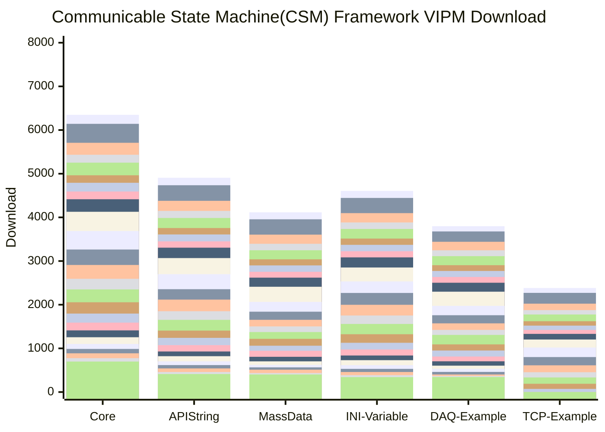

<!-------
本组织围绕可通讯状态机框架(CSM)架构、AI，提供LabVIEW/Python/C#语言下的自动化测试方案。
----->

- [NEVSTOP-LAB@VIPM](https://www.vipm.io/publisher/nevstop/)：LabVIEW 包管理平台，使用 VIPM 安装
- [NEVSTOP-LAB@PyPI](https://pypi.org/user/NEVSTOP-LAB/): Python 包管理平台，使用`PIP`指令安装
- [NEVSTOP-LAB@marketplace.visualstudio](https://marketplace.visualstudio.com/publishers/NEVSTOP-LAB): Microsoft Marketplace, VSCode/Visual Studio 等插件发布平台

> [!NOTE]
> **CSM Framework 目标是成长为一个多语言支持的测试系统基础框架**
> 1. LabVEIW CSM Framework 作为基础长期维护，并拓展到 C#, python 等  
> [Core](https://github.com/NEVSTOP-LAB/Communicable-State-Machine)
> | [API-String](https://github.com/NEVSTOP-LAB/CSM-API-String-Arguments-Support)
> | [MassData](https://github.com/NEVSTOP-LAB/CSM-MassData-Parameter-Support)
> | [INI-Variable](https://github.com/NEVSTOP-LAB/CSM-INI-Static-Variable-Support)
> 2. VSCode 插件：[csm-vsc-extension](https://github.com/NEVSTOP-LAB/csm-vsc-extension)
> 3. LabVIEW 插件：[mermaid Tool](https://github.com/NEVSTOP-LAB/CSM-Mermaid-Plugin)
> 4. Github CSM 复用模块: github topic:[csm-modsets](https://github.com/search?q=topic%3Acsm-modsets&type=repositories)
> 5. 应用场景的案例展示:  
> [DAQ-Application](https://github.com/NEVSTOP-LAB/CSM-Continuous-Meausrement-and-Logging)
> | [TCP-Application](https://github.com/NEVSTOP-LAB/CSM-TCP-Router-App)
> | [WebServer-Application](https://github.com/NEVSTOP-LAB/G-Web-Development-with-CSM)

> [!NOTE]
> **促进社区的分享和交流，形成良好的社区氛围，推动 CSM 生态的持续发展** 
> - [zhihu 专栏](https://www.zhihu.com/column/c_1681072169147342848) 作为信息发布的窗口
> - [NEVSTOP-LAB Organization](https://github.com/NEVSTOP-LAB) 组织具有开发能力的核心成员开发
> - [NEVSTOP-LAB Discussion](https://github.com/orgs/NEVSTOP-LAB/discussions) 作为问答平台，回复 `LabVIEW`/`CSM`/`项目设计`等的讨论平台

> [!NOTE]
> **AI-Wiki 机制, 自动收集更新 CSM 信息** --> [CSM-Wiki Website](https://nevstop-lab.github.io/CSM-Wiki/) 
> - [施工中] 由 AI 负责整理和更新 CSM 相关文档，确保信息的及时性和准确性 [CSM Wiki Repo](https://github.com/NEVSTOP-LAB/CSM-Wiki)
> - [Discussion:Q&A分组](https://github.com/orgs/NEVSTOP-LAB/discussions/categories/q-a) 中的问题，会得到 CSM-AI-Robot 的回复(deepseek-v4-pro) 

```mermaid
    xychart-beta
    title "Communicable State Machine(CSM) Framework VIPM Download"
    x-axis [Core, API String, MassData, INI-Variable, DAQ-Example, TCP-Example]
    y-axis "Download" 0 --> 8000
    bar   [6348, 4907, 4116, 4607, 3798, 2383, 2026.05]
    bar   [6142, 4736, 3956, 4445, 3678, 2271, 2026.04]
    bar   [5708, 4379, 3605, 4097, 3441, 2024, 2026.03]
    bar   [5434, 4148, 3395, 3884, 3246, 1876, 2026.02]
    bar   [5253, 3986, 3247, 3734, 3112, 1776, 2026.01]
    bar   [4964, 3756, 3039, 3514, 2905, 1622, 2025.12]
    bar   [4792, 3609, 2900, 3371, 2773, 1521, 2025.11]
    bar   [4592, 3451, 2753, 3225, 2635, 1422, 2025.10]
    bar   [4415, 3306, 2620, 3084, 2503, 1332, 2025.09]
    bar   [4128, 3068, 2411, 2852, 2298, 1203, 2025.08]
    bar   [3687, 2699, 2064, 2533, 1974, 1019, 2025.07]
    bar   [3264, 2355, 1840, 2269, 1759, 801, 2025.06]
    bar   [2910, 2117, 1654, 1998, 1573, 612, 2025.05]
    bar   [2593, 1851, 1503, 1753, 1423, 454, 2025.04]
    bar   [2350, 1653, 1374, 1559, 1308, 334, 2025.03]
    bar   [2056, 1407, 1218, 1324, 1091, 189, 2025.02]
    bar   [1797, 1241, 1061, 1128, 951, 72, 2025.01]
    bar   [1590, 1074, 945, 974, 813, 0, 2024.12]
    bar   [1412, 929, 807, 837, 704, 0, 2024.11]
    bar   [1255, 821, 703, 730, 604, 0, 2024.10]
    bar   [1101, 703, 621, 615, 532, 0, 2024.09]
    bar   [987, 617, 565, 531, 461, 0, 2024.08]
    bar   [887, 541, 512, 459, 402, 0, 2024.07]
    bar   [776, 459, 435, 387, 369, 0, 2024.06]
    bar   [698, 412, 402, 341, 344, 0, 2024.05]
```

👩‍💻 **Sorted By Tags**
--------------------
[`labview(65)`](https://github.com/search?q=topic:labview%20org:NEVSTOP-LAB%20is:public&type=Repositories)
[`labview-csm(22)`](https://github.com/search?q=topic:labview-csm%20org:NEVSTOP-LAB%20is:public&type=Repositories)
[`vipm(15)`](https://github.com/search?q=topic:vipm%20org:NEVSTOP-LAB%20is:public&type=Repositories)
[`cicd(11)`](https://github.com/search?q=topic:cicd%20org:NEVSTOP-LAB%20is:public&type=Repositories)
[`lvcicd(11)`](https://github.com/search?q=topic:lvcicd%20org:NEVSTOP-LAB%20is:public&type=Repositories)
[`example(9)`](https://github.com/search?q=topic:example%20org:NEVSTOP-LAB%20is:public&type=Repositories)
[`framework(8)`](https://github.com/search?q=topic:framework%20org:NEVSTOP-LAB%20is:public&type=Repositories)
[`labview-library(8)`](https://github.com/search?q=topic:labview-library%20org:NEVSTOP-LAB%20is:public&type=Repositories)
[`python(8)`](https://github.com/search?q=topic:python%20org:NEVSTOP-LAB%20is:public&type=Repositories)
[`jkism(6)`](https://github.com/search?q=topic:jkism%20org:NEVSTOP-LAB%20is:public&type=Repositories)
[`application(5)`](https://github.com/search?q=topic:application%20org:NEVSTOP-LAB%20is:public&type=Repositories)
[`ai(4)`](https://github.com/search?q=topic:ai%20org:NEVSTOP-LAB%20is:public&type=Repositories)
[`csm-modsets(4)`](https://github.com/search?q=topic:csm-modsets%20org:NEVSTOP-LAB%20is:public&type=Repositories)
[`html(4)`](https://github.com/search?q=topic:html%20org:NEVSTOP-LAB%20is:public&type=Repositories)
[`javascript(4)`](https://github.com/search?q=topic:javascript%20org:NEVSTOP-LAB%20is:public&type=Repositories)
[`template(4)`](https://github.com/search?q=topic:template%20org:NEVSTOP-LAB%20is:public&type=Repositories)
[`environments(3)`](https://github.com/search?q=topic:environments%20org:NEVSTOP-LAB%20is:public&type=Repositories)
[`lv-csm-app(3)`](https://github.com/search?q=topic:lv-csm-app%20org:NEVSTOP-LAB%20is:public&type=Repositories)
[`ui(3)`](https://github.com/search?q=topic:ui%20org:NEVSTOP-LAB%20is:public&type=Repositories)
[`vip(3)`](https://github.com/search?q=topic:vip%20org:NEVSTOP-LAB%20is:public&type=Repositories)
[`vscode(3)`](https://github.com/search?q=topic:vscode%20org:NEVSTOP-LAB%20is:public&type=Repositories)
[`archived(2)`](https://github.com/search?q=topic:archived%20org:NEVSTOP-LAB%20is:public&type=Repositories)
[`base-function(2)`](https://github.com/search?q=topic:base-function%20org:NEVSTOP-LAB%20is:public&type=Repositories)
[`c(2)`](https://github.com/search?q=topic:c%20org:NEVSTOP-LAB%20is:public&type=Repositories)
[`daq(2)`](https://github.com/search?q=topic:daq%20org:NEVSTOP-LAB%20is:public&type=Repositories)
[`exe(2)`](https://github.com/search?q=topic:exe%20org:NEVSTOP-LAB%20is:public&type=Repositories)
[`github-actions(2)`](https://github.com/search?q=topic:github-actions%20org:NEVSTOP-LAB%20is:public&type=Repositories)
[`labview-xcontrol(2)`](https://github.com/search?q=topic:labview-xcontrol%20org:NEVSTOP-LAB%20is:public&type=Repositories)
[`national-instruments(2)`](https://github.com/search?q=topic:national-instruments%20org:NEVSTOP-LAB%20is:public&type=Repositories)
[`quickdrop(2)`](https://github.com/search?q=topic:quickdrop%20org:NEVSTOP-LAB%20is:public&type=Repositories)
[`scss(2)`](https://github.com/search?q=topic:scss%20org:NEVSTOP-LAB%20is:public&type=Repositories)
[`shell(2)`](https://github.com/search?q=topic:shell%20org:NEVSTOP-LAB%20is:public&type=Repositories)
[`skills(2)`](https://github.com/search?q=topic:skills%20org:NEVSTOP-LAB%20is:public&type=Repositories)
[`tagdb(2)`](https://github.com/search?q=topic:tagdb%20org:NEVSTOP-LAB%20is:public&type=Repositories)
[`transformer(2)`](https://github.com/search?q=topic:transformer%20org:NEVSTOP-LAB%20is:public&type=Repositories)
[`typescript(2)`](https://github.com/search?q=topic:typescript%20org:NEVSTOP-LAB%20is:public&type=Repositories)
[`utilites(2)`](https://github.com/search?q=topic:utilites%20org:NEVSTOP-LAB%20is:public&type=Repositories)

<!-- CSM_MODSETS_START -->
<pre>
<a href="https://github.com/NEVSTOP-LAB">NEVSTOP-LAB</a> (5)
  <a href="https://github.com/NEVSTOP-LAB/CSMScript-Lite">CSMScript-Lite</a> ⭐19 CSMScript Lite版本，一款轻量级脚本执行引擎，用于执行灵活的 CSM 测试脚本
  <a href="https://github.com/NEVSTOP-LAB/CSM-TCP-Router-App">CSM-TCP-Router-App</a> ⭐8 Application Example to show how to setup a TCP Server and Client using CSM and JKI TCP Server.
  <a href="https://github.com/NEVSTOP-LAB/CSM-ModSets-FileSync">CSM-ModSets-FileSync</a> ⭐4 基于 CSM 的文件同步模块
  <a href="https://github.com/NEVSTOP-LAB/CSM-Modsets-WaveformDisplay">CSM-Modsets-WaveformDisplay</a> CSM 模块: 显示 Waveform
  <a href="https://github.com/NEVSTOP-LAB/CSM-Modsets-ScheduledCmdWindow">CSM-Modsets-ScheduledCmdWindow</a> CSM模块：计划命令窗口
</pre>
<!-- CSM_MODSETS_END -->

<!--

**Here are some ideas to get you started:**

🙋‍♀️ A short introduction - what is your organization all about?
🌈 Contribution guidelines - how can the community get involved?
🍿 Fun facts - what does your team eat for breakfast?
🧙 Remember, you can do mighty things with the power of [Markdown](https://docs.github.com/github/writing-on-github/getting-started-with-writing-and-formatting-on-github/basic-writing-and-formatting-syntax)
-->
