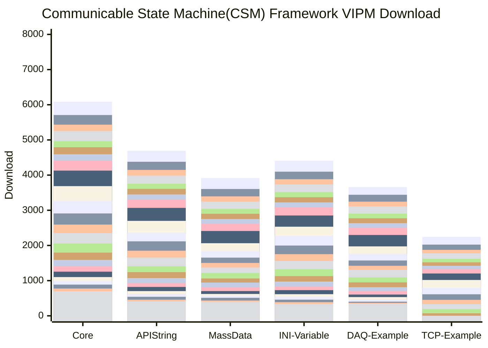

🙋‍♀️ **Introduction**
--------------------

This organization is dedicated to creating and sharing reusable content that can be used to enhance the LabVIEW programming experience. Our team has put together a collection of tools, programming environments, and supplementary functions that you might find useful.

🧙 **Toolkits Recommended**
--------------------

🧙 **[Communicable State Machine(CSM) Framework](https://github.com/search?q=topic%3Alabview-csm+org%3ANEVSTOP-LAB&type=Repositories)** ->> [Wiki Website](https://nevstop-lab.github.io/CSM-Wiki/)

| Name | Description |Download|
|------|-------------|-------------|
| [Communicable State Machine(CSM) Framework](https://github.com/NEVSTOP-LAB/Communicable-State-Machine) | LabVIEW Application Framework extended from JKI State Machine(JKISM). |     |
| [CSM MassData Arguments Support](https://github.com/NEVSTOP-LAB/CSM-MassData-Parameter-Support) | Addons for Data Arguments support of CSM. |    |
| [CSM API String Arguments Support](https://github.com/NEVSTOP-LAB/CSM-API-String-Arugments-Support) | Enhance API String Arguments support of CSM. |    |
| [CSM-INI-Static-Variable-Support](https://github.com/NEVSTOP-LAB/CSM-INI-Static-Variable-Support) | Support of Static Variables which are loaded from ini configuration file for CSM. |    |
| [CSM-Icon-Editor-Glyphs](https://github.com/NEVSTOP-LAB/CSM-Icon-Editor-Glyphs) | CSM glyphs in icon editor. |     |
| [CSM-Mermaid-Plugin](https://github.com/NEVSTOP-LAB/CSM-Mermaid-Plugin) | Mermaid Tool Plugin for CSM (In Development) |      |
| [CSM Continuous Measurement and Logging Example](https://github.com/NEVSTOP-LAB/CSM-Continuous-Meausrement-and-Logging) | Accomplish application of Continuous Measurement and Logging with CSM. It's much more simple, intuitive and graceful. |     |
| [CSM-TCP-Router-Example](https://github.com/NEVSTOP-LAB/CSM-TCP-Router-App) | Application Example to show how to setup a TCP Server and Client using CSM and JKI TCP Server. |    |
| [CSM-Wiki](https://github.com/NEVSTOP-LAB/CSM-Wiki) | CSM Wiki Repo. | N/A |

<!---
| [CSM Array Arguments Support](https://github.com/NEVSTOP-LAB/CSM-Array-Parameter-Support) | Addons for Array Arguments support of CSM. |  |
--->

```mermaid
    xychart-beta
    title "Communicable State Machine(CSM) Framework VIPM Download"
    x-axis [Core, API String, MassData, INI-Variable, DAQ-Example, TCP-Example]
    y-axis "Download" 0 --> 8000
    bar   [6085, 4692, 3917, 4407, 3659, 2247, 2026.04]
    bar   [5708, 4379, 3605, 4097, 3441, 2024, 2026.03]
    bar   [5434, 4148, 3395, 3884, 3246, 1876, 2026.02]
    bar   [5253, 3986, 3247, 3734, 3112, 1776, 2026.01]
    bar   [4964, 3756, 3039, 3514, 2905, 1622, 2025.12]
    bar   [4792, 3609, 2900, 3371, 2773, 1521, 2025.11]
    bar   [4592, 3451, 2753, 3225, 2635, 1422, 2025.10]
    bar   [4415, 3306, 2620, 3084, 2503, 1332, 2025.09]
    bar   [4128, 3068, 2411, 2852, 2298, 1203, 2025.08]
    bar   [3687, 2699, 2064, 2533, 1974, 1019, 2025.07]
    bar   [3264, 2355, 1840, 2269, 1759, 801, 2025.06]
    bar   [2910, 2117, 1654, 1998, 1573, 612, 2025.05]
    bar   [2593, 1851, 1503, 1753, 1423, 454, 2025.04]
    bar   [2350, 1653, 1374, 1559, 1308, 334, 2025.03]
    bar   [2056, 1407, 1218, 1324, 1091, 189, 2025.02]
    bar   [1797, 1241, 1061, 1128, 951, 72, 2025.01]
    bar   [1590, 1074, 945, 974, 813, 0, 2024.12]
    bar   [1412, 929, 807, 837, 704, 0, 2024.11]
    bar   [1255, 821, 703, 730, 604, 0, 2024.10]
    bar   [1101, 703, 621, 615, 532, 0, 2024.09]
    bar   [987, 617, 565, 531, 461, 0, 2024.08]
    bar   [887, 541, 512, 459, 402, 0, 2024.07]
    bar   [776, 459, 435, 387, 369, 0, 2024.06]
    bar   [698, 412, 402, 341, 344, 0, 2024.05]
```

👩‍💻 **Sorted By Tags**
--------------------
[`labview(36)`](https://github.com/search?q=topic:labview%20org:NEVSTOP-LAB%20is:public&type=Repositories)
[`labview-csm(17)`](https://github.com/search?q=topic:labview-csm%20org:NEVSTOP-LAB%20is:public&type=Repositories)
[`cicd(11)`](https://github.com/search?q=topic:cicd%20org:NEVSTOP-LAB%20is:public&type=Repositories)
[`lvcicd(11)`](https://github.com/search?q=topic:lvcicd%20org:NEVSTOP-LAB%20is:public&type=Repositories)
[`example(8)`](https://github.com/search?q=topic:example%20org:NEVSTOP-LAB%20is:public&type=Repositories)
[`labview-library(8)`](https://github.com/search?q=topic:labview-library%20org:NEVSTOP-LAB%20is:public&type=Repositories)
[`vipm(8)`](https://github.com/search?q=topic:vipm%20org:NEVSTOP-LAB%20is:public&type=Repositories)
[`framework(7)`](https://github.com/search?q=topic:framework%20org:NEVSTOP-LAB%20is:public&type=Repositories)
[`jkism(6)`](https://github.com/search?q=topic:jkism%20org:NEVSTOP-LAB%20is:public&type=Repositories)
[`application(5)`](https://github.com/search?q=topic:application%20org:NEVSTOP-LAB%20is:public&type=Repositories)
[`csm-modsets(3)`](https://github.com/search?q=topic:csm-modsets%20org:NEVSTOP-LAB%20is:public&type=Repositories)
[`environments(3)`](https://github.com/search?q=topic:environments%20org:NEVSTOP-LAB%20is:public&type=Repositories)
[`lv-csm-app(3)`](https://github.com/search?q=topic:lv-csm-app%20org:NEVSTOP-LAB%20is:public&type=Repositories)
[`ui(3)`](https://github.com/search?q=topic:ui%20org:NEVSTOP-LAB%20is:public&type=Repositories)
[`vip(3)`](https://github.com/search?q=topic:vip%20org:NEVSTOP-LAB%20is:public&type=Repositories)
[`ai(2)`](https://github.com/search?q=topic:ai%20org:NEVSTOP-LAB%20is:public&type=Repositories)
[`base-function(2)`](https://github.com/search?q=topic:base-function%20org:NEVSTOP-LAB%20is:public&type=Repositories)
[`exe(2)`](https://github.com/search?q=topic:exe%20org:NEVSTOP-LAB%20is:public&type=Repositories)
[`github-actions(2)`](https://github.com/search?q=topic:github-actions%20org:NEVSTOP-LAB%20is:public&type=Repositories)
[`labview-xcontrol(2)`](https://github.com/search?q=topic:labview-xcontrol%20org:NEVSTOP-LAB%20is:public&type=Repositories)
[`national-instruments(2)`](https://github.com/search?q=topic:national-instruments%20org:NEVSTOP-LAB%20is:public&type=Repositories)
[`python(2)`](https://github.com/search?q=topic:python%20org:NEVSTOP-LAB%20is:public&type=Repositories)
[`quickdrop(2)`](https://github.com/search?q=topic:quickdrop%20org:NEVSTOP-LAB%20is:public&type=Repositories)
[`tagdb(2)`](https://github.com/search?q=topic:tagdb%20org:NEVSTOP-LAB%20is:public&type=Repositories)
[`transformer(2)`](https://github.com/search?q=topic:transformer%20org:NEVSTOP-LAB%20is:public&type=Repositories)
[`utilites(2)`](https://github.com/search?q=topic:utilites%20org:NEVSTOP-LAB%20is:public&type=Repositories)

<!--

**Here are some ideas to get you started:**

🙋‍♀️ A short introduction - what is your organization all about?
🌈 Contribution guidelines - how can the community get involved?
🍿 Fun facts - what does your team eat for breakfast?
🧙 Remember, you can do mighty things with the power of [Markdown](https://docs.github.com/github/writing-on-github/getting-started-with-writing-and-formatting-on-github/basic-writing-and-formatting-syntax)
-->
